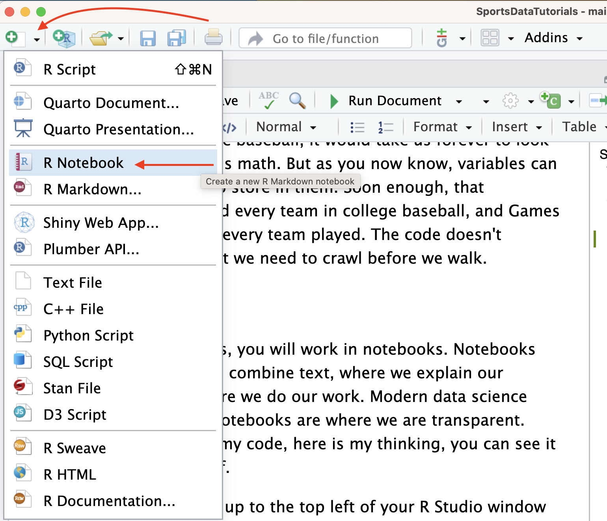
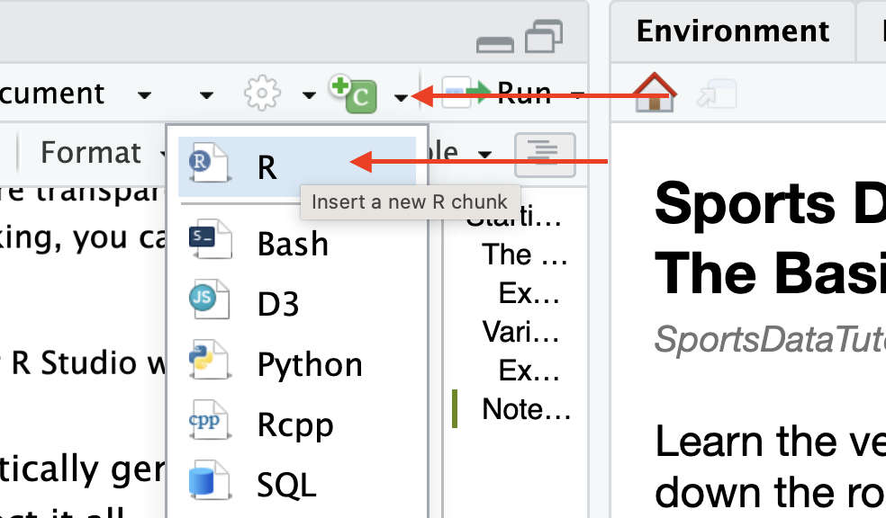
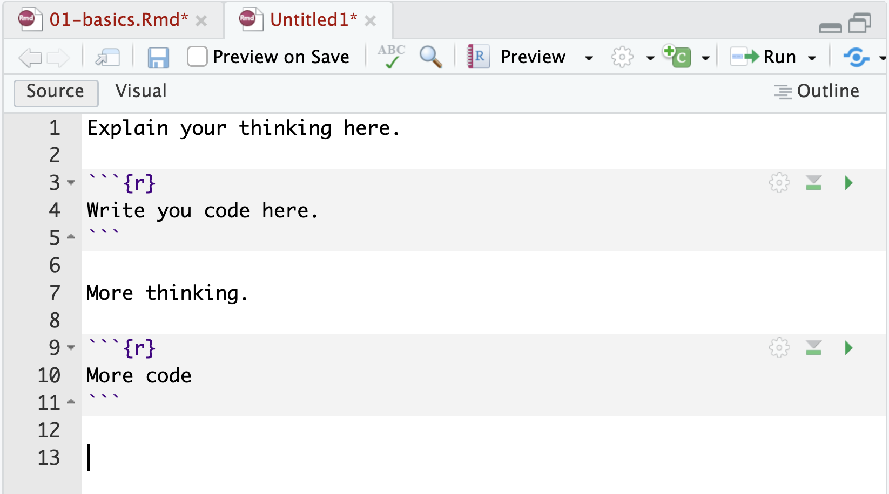

```{r setup, include=FALSE}
library(learnr)
library(gradethis)
library(tidyverse)
library(glue)
knitr::opts_chunk$set(echo = FALSE)
tutorial_options(exercise.completion=FALSE)
```
```{r load-data, message=FALSE, warning=FALSE}
state <- Sys.getenv("tutorial.state")

stateName <- read_csv("https://the-art-of-data-journalism.github.io/tutorial-data/states.csv") |> filter(Postal == state) 

stateName <- stateName |> 
  mutate(dataurl = case_when(
    Postal == "AL" ~ paste0("https://the-art-of-data-journalism.github.io/tutorial-data/census-estimates/", str_to_lower(State), ".csv"),
    Postal == "AK" ~ paste0("https://the-art-of-data-journalism.github.io/tutorial-data/census-estimates/", str_to_lower(State), ".csv"),
    Postal == "AZ" ~ paste0("https://the-art-of-data-journalism.github.io/tutorial-data/census-estimates/", str_to_lower(State), ".csv"),
    Postal == "AR" ~ paste0("https://the-art-of-data-journalism.github.io/tutorial-data/census-estimates/", str_to_lower(State), ".csv"),
    Postal == "CA" ~ paste0("https://the-art-of-data-journalism.github.io/tutorial-data/census-estimates/", str_to_lower(State), ".csv"),
    Postal == "CO" ~ paste0("https://the-art-of-data-journalism.github.io/tutorial-data/census-estimates/", str_to_lower(State), ".csv"),
    Postal == "CT" ~ paste0("https://the-art-of-data-journalism.github.io/tutorial-data/census-estimates/", str_to_lower(State), ".csv"),
    Postal == "DE" ~ paste0("https://the-art-of-data-journalism.github.io/tutorial-data/census-estimates/", str_to_lower(State), ".csv"),
    Postal == "FL" ~ paste0("https://the-art-of-data-journalism.github.io/tutorial-data/census-estimates/", str_to_lower(State), ".csv"),
    Postal == "GA" ~ paste0("https://the-art-of-data-journalism.github.io/tutorial-data/census-estimates/", str_to_lower(State), ".csv"),
    Postal == "HI" ~ paste0("https://the-art-of-data-journalism.github.io/tutorial-data/census-estimates/", str_to_lower(State), ".csv"),
    Postal == "ID" ~ paste0("https://the-art-of-data-journalism.github.io/tutorial-data/census-estimates/", str_to_lower(State), ".csv"),
    Postal == "IL" ~ paste0("https://the-art-of-data-journalism.github.io/tutorial-data/census-estimates/", str_to_lower(State), ".csv"),
    Postal == "IN" ~ paste0("https://the-art-of-data-journalism.github.io/tutorial-data/census-estimates/", str_to_lower(State), ".csv"),
    Postal == "IA" ~ paste0("https://the-art-of-data-journalism.github.io/tutorial-data/census-estimates/", str_to_lower(State), ".csv"),
    Postal == "KS" ~ paste0("https://the-art-of-data-journalism.github.io/tutorial-data/census-estimates/", str_to_lower(State), ".csv"),
    Postal == "KY" ~ paste0("https://the-art-of-data-journalism.github.io/tutorial-data/census-estimates/", str_to_lower(State), ".csv"),
    Postal == "LA" ~ paste0("https://the-art-of-data-journalism.github.io/tutorial-data/census-estimates/", str_to_lower(State), ".csv"),
    Postal == "ME" ~ paste0("https://the-art-of-data-journalism.github.io/tutorial-data/census-estimates/", str_to_lower(State), ".csv"),
    Postal == "MD" ~ paste0("https://the-art-of-data-journalism.github.io/tutorial-data/census-estimates/", str_to_lower(State), ".csv"),
    Postal == "MA" ~ paste0("https://the-art-of-data-journalism.github.io/tutorial-data/census-estimates/", str_to_lower(State), ".csv"),
    Postal == "MI" ~ paste0("https://the-art-of-data-journalism.github.io/tutorial-data/census-estimates/", str_to_lower(State), ".csv"),
    Postal == "MN" ~ paste0("https://the-art-of-data-journalism.github.io/tutorial-data/census-estimates/", str_to_lower(State), ".csv"),
    Postal == "MS" ~ paste0("https://the-art-of-data-journalism.github.io/tutorial-data/census-estimates/", str_to_lower(State), ".csv"),
    Postal == "MO" ~ paste0("https://the-art-of-data-journalism.github.io/tutorial-data/census-estimates/", str_to_lower(State), ".csv"),
    Postal == "MT" ~ paste0("https://the-art-of-data-journalism.github.io/tutorial-data/census-estimates/", str_to_lower(State), ".csv"),
    Postal == "NE" ~ paste0("https://the-art-of-data-journalism.github.io/tutorial-data/census-estimates/", str_to_lower(State), ".csv"),
    Postal == "NV" ~ paste0("https://the-art-of-data-journalism.github.io/tutorial-data/census-estimates/", str_to_lower(State), ".csv"),
    Postal == "NH" ~ paste0("https://the-art-of-data-journalism.github.io/tutorial-data/census-estimates/", str_to_lower(State), ".csv"),
    Postal == "NJ" ~ paste0("https://the-art-of-data-journalism.github.io/tutorial-data/census-estimates/", str_to_lower(State), ".csv"),
    Postal == "NM" ~ paste0("https://the-art-of-data-journalism.github.io/tutorial-data/census-estimates/", str_to_lower(State), ".csv"),
    Postal == "NY" ~ paste0("https://the-art-of-data-journalism.github.io/tutorial-data/census-estimates/", str_to_lower(State), ".csv"),
    Postal == "NC" ~ paste0("https://the-art-of-data-journalism.github.io/tutorial-data/census-estimates/", str_to_lower(State), ".csv"),
    Postal == "ND" ~ paste0("https://the-art-of-data-journalism.github.io/tutorial-data/census-estimates/", str_to_lower(State), ".csv"),
    Postal == "OH" ~ paste0("https://the-art-of-data-journalism.github.io/tutorial-data/census-estimates/", str_to_lower(State), ".csv"),
    Postal == "OK" ~ paste0("https://the-art-of-data-journalism.github.io/tutorial-data/census-estimates/", str_to_lower(State), ".csv"),
    Postal == "OR" ~ paste0("https://the-art-of-data-journalism.github.io/tutorial-data/census-estimates/", str_to_lower(State), ".csv"),
    Postal == "PA" ~ paste0("https://the-art-of-data-journalism.github.io/tutorial-data/census-estimates/", str_to_lower(State), ".csv"),
    Postal == "RI" ~ paste0("https://the-art-of-data-journalism.github.io/tutorial-data/census-estimates/", str_to_lower(State), ".csv"),
    Postal == "SC" ~ paste0("https://the-art-of-data-journalism.github.io/tutorial-data/census-estimates/", str_to_lower(State), ".csv"),
    Postal == "SD" ~ paste0("https://the-art-of-data-journalism.github.io/tutorial-data/census-estimates/", str_to_lower(State), ".csv"),
    Postal == "TN" ~ paste0("https://the-art-of-data-journalism.github.io/tutorial-data/census-estimates/", str_to_lower(State), ".csv"),
    Postal == "TX" ~ paste0("https://the-art-of-data-journalism.github.io/tutorial-data/census-estimates/", str_to_lower(State), ".csv"),
    Postal == "UT" ~ paste0("https://the-art-of-data-journalism.github.io/tutorial-data/census-estimates/", str_to_lower(State), ".csv"),
    Postal == "VT" ~ paste0("https://the-art-of-data-journalism.github.io/tutorial-data/census-estimates/", str_to_lower(State), ".csv"),
    Postal == "VA" ~ paste0("https://the-art-of-data-journalism.github.io/tutorial-data/census-estimates/", str_to_lower(State), ".csv"),
    Postal == "WA" ~ paste0("https://the-art-of-data-journalism.github.io/tutorial-data/census-estimates/", str_to_lower(State), ".csv"),
    Postal == "WV" ~ paste0("https://the-art-of-data-journalism.github.io/tutorial-data/census-estimates/", str_to_lower(State), ".csv"),
    Postal == "WI" ~ paste0("https://the-art-of-data-journalism.github.io/tutorial-data/census-estimates/", str_to_lower(State), ".csv"),
    Postal == "WY" ~ paste0("https://the-art-of-data-journalism.github.io/tutorial-data/census-estimates/", str_to_lower(State), ".csv"),
    TRUE ~ "https://the-art-of-data-journalism.github.io/tutorial-data/census-estimates/nebraska.csv"  # Default case if none match
  ))

census <- read_csv(stateName$dataurl)

biggest <- census |> filter(POPESTIMATE2023 == max(POPESTIMATE2023))
counties <- nrow(census)

countyLanguage <- case_when(
  state == "AK" ~ c("county equivalent", "county equivalents"),
  state == "CT" ~ c("planning region", "planning regions"),
  state == "LA" ~ c("parish", "parishes"),
  state == "VA" ~ c("county or city", "counties or cities"),
  TRUE ~ c("county", "counties")
)

pctchange <- (biggest$POPESTIMATE2023 - biggest$POPESTIMATE2022)/biggest$POPESTIMATE2022

natchng <- biggest$BIRTHS2023 - biggest$DEATHS2023
```
## The Goal

```{r intro, exercise=FALSE, exercise.eval=TRUE, exercise.setup = "load-data", results='asis'}
glue("Welcome, student from {stateName$State}. This introductory lesson aims to familiarize you with the fundamental concepts of R programming in the context of data journalism. The primary goal is to help learners understand the basic syntax of R, its function as a calculator, and the crucial concept of variables. By the end of this tutorial, you should be comfortable with simple mathematical operations in R, understand the importance of order in calculations (PEMDAS), and grasp the basics of creating and using variables to store both numeric and string data.") 
```

## What is Data Journalism?

Not to sound overly grandiose, but data journalism is much like our theoretical understanding of the universe itself: Changing and expanding all the time. It is art and science. It is a skill and a philosophy. And it can't be easily summarized in a single section of a textbook, so we're not going to do that. We'll take it in chunks, and maybe we'll get somewhere by the end. 

A simple way to think about data journalism is to think about it as using data as a source. 

"It can be a really powerful and comprehensive source that can give sweeping answers to questions that people can't," said Ben Welsh, the news applications editor at Reuters. "But to get the answers to those questions, we've got to learn how to ask in this more structured language of computer programming and data tables.

"And those methods really aren't that complicated."

What you're about to learn in this series of tutorials is how to ask questions of data, the same way you would ask a source, using the structured language Ben describes. It's a very specific form, which for most people is unlike anything you've ever done before. 

But that's not a worry. 

Ask any data journalist about how they learned, and they'll all tell you they started from square one. MaryJo Webster, the data editor at the Star Tribune in Minneapolis, has been a journalist in the Twin Cities for more than 20 years. When she started as a professional, she had no data skills.

"I didn't even know spreadsheets existed when I was a beginner reporter," she said. "I was covering the police beat, and I had to write about the city budget, and the police department's budget looked like it was going up a lot. So I had done the percentage change calculation year over year and saw that it was very high. Then I wanted to be able to say, how does that compare to all the other departments in the city?"

What did she do? She pulled out a calculator and started doing the calculations one by one. As she was doing this, a colleague walked by and suggested a spreadsheet. He showed her how to write a formula that would calculate percent change, and then how to apply that formula to every city department. Boom -- hours of tedious calculations done in one click.

"My jaw was on the floor going, what?" Webster said. "That was amazing to me."

Soon, you will be able to take tens of thousands of rows of data and turn that into information that you can turn into a story or a graphic. You'll know how to ask questions of data, what number is the right number in this spot, and how to get answers that readers want -- what's the biggest, the smallest, the fastest growing, declining the quickest, the most dangerous, and many, many other things that make news. 

## The Basics

R is a programming language, one specifically geared toward statistical analysis. Like all programming languages, it has certain built-in functions and you can interact with it in multiple ways. The first, and most basic, is the console. Think of the console like talking directly to R. It's direct, but it has some drawbacks and some quirks we'll get into later.

For now, we're going to use windows in this page like console windows. You'll type commands into the boxes below and hit the Run Code button on the top right of the box. Be sure that you're reading closely -- things like spaces, capitalization and spelling all matter. Some things matter to the point that if you miss them, the code won't work. Other things are stylistic. It takes time and practice to know the difference.

To be clear: Everyone makes mistakes. Everyone makes dumb mistakes. Everyone overlooks dumb mistakes for hours only to be shown the missing comma. *You aren't dumb*. You're like every single person who has ever tried to learn how to code.

One of the most difficult hurdles for beginning students of mathematics to get over is notation. If you miss a day, tune out for a class, or just never get around to asking what something means, you'll be lost. So let's just cover some bases and make sure we all understand some ultra-basic notation.

You might laugh at these, but someone reading them is looking up Gods on Wikipedia to thank. So do yourself a favor and refresh.

| Symbol | Meaning        | Example |
|--------|----------------|---------|
| \+     | addition       | 5+2     |
| \-     | subtraction    | 6-2     |
| \*     | multiplication | 7\*2    |
| /      | division       | 8/2     |
| \^     | exponent       | 2\^3    |
| sqrt   | square root    | sqrt(4) |

One of the most important and often overlooked concepts in basic math is the order that you do the calculations. When you have something like `5+5*5^2`, which gets done first?

In math, and in code, order matters. If you must do A before you do B, then A needs to appear before and run before B. You need to keep track of when things happen.

Thankfully, math teachers have provided us an easy to remember mnemonic that you probably learned in sixth grade and tried to forget until now.

**PEMDAS** -- **P**arenthesis, **E**xponents, **M**ultiplication, **D**ivision, **A**ddition, **S**ubtraction

What that means is when you look at a mathematical formula you do the calculations in the order PEMDAS tells you. Something in parenthesis? Do that first. Is there an exponent? Do that next. Multiplication or division? It's next and finally addition and subtraction. Knowing PEMDAS will save you from stupid mistakes down the road.

### Exercise 1: Using R like a calculator

*Write the code necessary to add 23 and 62 together.* In this case, it's super simple.

```{r addition, exercise=TRUE, exercise.reveal_solution = FALSE}

```

```{r addition-solution, exercise.reveal_solution = FALSE}
23+62
```

```{r addition-check}
grade_this_code()
```

Congrats, you've run some code. It's not very complex, and you knew the answer beforehand (maybe, probably), but you get the idea.

### Exercise 2: A more complicated example

```{r counties, exercise=FALSE, exercise.eval=TRUE, exercise.setup = "load-data", results='asis'}
glue("Let's put you in Mary Jo Webster's shoes. Your editor has asked you to look at the latest rounds of population estimates for {countyLanguage[2]} in {stateName$State}. There are {counties} {countyLanguage[2]} in {stateName$State}, and as much as I want to make you do all of them, let's just focus on the most populated: {biggest$CTYNAME}.") 
```

What you need to know, and what Webster learned that day when she discovered data journalism, is the formula for percent change. Why are we using percent change? How can you compare Los Angeles County in California -- the largest by population in the country, and would be the 11th most populous state if it seceeded -- to Loving County, Texas, the smallest county in the United States, with about 40 people in it? If 10 people move out of LA, no one is going to notice. If 10 people move out of Loving County, that's catastrophic. To compare them, you have to put them on a level playing field. We do that with percent change. 

The formula for percent change is easy. It's (new - old)/old. You take the most recent data you have, subtract the number from the oldest time period you're looking at, and the divide it by that same oldest number. 

```{r change, exercise=FALSE, exercise.eval=TRUE, exercise.setup = "load-data", results='asis'}
glue("As of the latest estimates, {biggest$CTYNAME} had {biggest$POPESTIMATE2023} in 2023 and {biggest$POPESTIMATE2022} in 2022. Fill in numbers into the formula and you'll be able to tell your editor how much {biggest$CTYNAME} changed in one year.") 
```

```{r percentchange, exercise=TRUE, exercise.reveal_solution = FALSE, exercise.setup = "load-data"}
(____ - ____)/____
```

```{r percentchange-check}
grade_this({
  if (identical(.result, pctchange)) {
    pass("Great work! You calculated percent change. You now know more useful math than most reporters. I wish I was making that up.")
  }
  fail()
})
```

## Variables

So we've learned that we can compute things. We can also store things. **In programming languages, these are called variables**. We can assign things to variables using `<-`. And then we can do things with them. **The `<-` is a called an assignment operator**.

<div class="alert alert-info">
<h4 class="alert-heading">Key Concept</h4> 
<p class="mb-0">Variables store data. Could be a word, or number. Could be an entire dataset. And we assign that data to our variable with <code><-</code>.</p>
</div>

With variables, we can assign names to values. Let's try it.

### Exercise 3: Variables

One of the key concepts of programming that you'll need to learn is that most things are a pattern. You'll see that doing certain things takes the same form each time, and all you're doing is changing small parts of the pattern to fit what you want to do.

Declaring variables is a pattern. The pattern here is `Name Of The Thing <- Value Of The Thing`.

```{r joke, exercise=FALSE, exercise.eval=TRUE, exercise.setup = "load-data", results='asis'}
glue("Names can be anything you want them to be, but they have to be one word, and it's better if they have no numbers or symbols in it. So you can create a variable called {stateName$State}IsTheGreatestPlaceOnEarth if you want. But some questions for you: What is that variable going to contain? Is it obvious by the name? And do you want to try and type that again? How about three more times? Yeah, me neither.") 
```

### 5 Rules For Naming Variables

1.  One word, no spaces.
2.  If you must use a number, it has to be at the end, never at the beginning.
3.  No symbols (like ! or ? or \# or anything like it).
4.  Keep them short, but never one letter. If your variable is holding the number of voters in a county, don't call it v.
5.  Make them understandable. If your variable is holding the number of voters in a county, call it `voters`. Keep it simple.

The next thing we need to know about are the values. There's a bunch of different kinds of values, but two that we're going to work with the most are **strings** and **numbers**. A string is just text. Your name is a string. Your home address is a string. For the most part, strings aren't hard -- they're anything you wouldn't do math on. So, for example, your phone number is a string, even though it's made up of numbers. If we add your phone number to mine, do we get something meaningful? No. Same with ZIP codes. They're strings.

**To record a string, you put it in quotes.** So `myname <- "Matt"` is how to set the value of the variable myname to Matt.

**To record a number, do *not* use quotes.** So `myage <- 29` is how to set the value of the variable myage to 29, which is me wishfully thinking through variables.

Where this becomes a problem is where you try to make a string into a number or try to do math with strings.

In the window below, create two variables called Number1 and Number2. Set Number1 to 5 and Number2 to "5" with the quotes. Then try adding Number1 + Number2. What happens?

```{r intentional-error-one, exercise=TRUE}

```

You get an error. `non-numeric argument to binary operator` is a rather computer-ish way of saying you tried to add 5 and Zebra. You can't add those two things together. So when you see that error, the non-numeric part is your hint that you're trying to do math on something that isn't a number. To fix it, just remove the quotes.

```{r natural, exercise=FALSE, exercise.eval=TRUE, exercise.setup = "load-data", results='asis'}
glue("Let's do something more real and figure out what demographers call the natural population change in {biggest$CTYNAME}. The natural popultion change is simple -- you take how many people were born and subtract how many people died. If more people were born than died, you get natural population growth. If you get the opposite, you get natural population decline.\n\nTo do this, we're going to create some variables -- one called born, one called died. In {biggest$CTYNAME}, {biggest$BIRTHS2023} were born in 2023, and {biggest$DEATHS2023} died. Assign those numbers to born and died and then use born and died to calculate the natural population change.") 
```

Couple of things to pay attention to here: Born is not born, as Died is not DIED is not DiEd and so on. Capitalization matters. The variables you are creating are `born` and `died`. Second: Commas in your numbers will break your code. Use 12345 not 12,345.


```{r variables-one, exercise=TRUE, exercise.reveal_solution = FALSE, exercise.setup = "load-data"}
____ <- ____
____ <- ____

____ - ____
```

```{r variables-one-hint}
born <- ??
died <- ??
SOMETHING - SOMETHING
```

```{r variables-one-check}
grade_this({
  if (identical(.result, natchng)) {
    pass("Great work! You calculated the natural population change.")
  }
  fail()
})
```

```{r sowhat, exercise=FALSE, exercise.eval=TRUE, exercise.setup = "load-data", results='asis'}
glue("You might be thinking ... that's interesting, but so what? And you'd be right -- you've figured out the natural population change for the largest county or county equivalent in your state. And it wasn't hard, but now do it for all {counties} in {stateName$State}. Less fun, no? There must be a better way to do this. Please? There is, and we'll get there.") 
```

## Notebooks

Outside of these tutorials, you will work in notebooks. Notebooks are a place where we can combine text, where we explain our thinking, with code, where we do our work. Modern data science requires transparency. Notebooks are where we are transparent. Here is my data, here is my code, here is my thinking, you can see it all and judge for yourself.

To make a notebook, go up to the top left of your R Studio window and you'll see a green plus sign. Click that, and go down to R Notebook. Or, you can go to the File menu and go to New File and then to R Notebook.

{width="100%"}

You'll notice, in your notebook, a lot of automatically generated text. We do not want that. So you'll need to select it all - command A on a Mac, control A on Windows - and hit delete. You should have a blank page now.

Text -- explanations -- go between code chunks. At first, just write a sentence.

Then, you can click the green C in the tool bar and go to R or use the keyboard shortcut to add a chunk: Ctrl + Alt + I on Windows or Command + Option + I on Mac.

{width="100%"}

Then, it's simply a matter of putting things where they need to go.

{width="100%"}

When it's time to turn it in, you just go to File \> Save and give the file a name and save it. When asked, you're turning in the .Rmd file you just saved.

## The Recap

In this lesson, we covered the essentials of R programming for beginners. We learned how to use R as a calculator, performing basic arithmetic operations and understanding the order of operations (PEMDAS). We then explored the concept of variables, learning how to create them, name them effectively, and assign different types of values (numbers and strings) to them. We practiced these skills by calculating the percentage of undergraduate students at UNL, demonstrating how these basic concepts can be applied to real-world data analysis tasks. Remember, mastering these fundamentals is crucial as they form the foundation for more complex data journalism techniques we'll explore in future lessons.

## Terms to Know

-   R: A programming language specifically designed for statistical analysis and data manipulation.
-   Console: The basic interface for interacting directly with R, where commands are entered and executed line by line.
-   Variable: A named storage location in a program that holds a value, which can be a number, text, or other data types.
-   Assignment operator (\<-): The symbol used in R to assign a value to a variable (e.g., x \<- 5).
-   String: A data type representing text, enclosed in quotation marks (e.g., "Hello, world!").
-   Numeric: A data type representing numbers that can be used in mathematical operations.
-   PEMDAS: An acronym for the order of operations in mathematics (Parentheses, Exponents, Multiplication, Division, Addition, Subtraction).
-   Function: A reusable block of code that performs a specific task, often taking inputs and returning outputs.
-   Syntax: The set of rules that define how R code must be written to be valid and executable.
-   Data type: A classification that specifies which type of value a variable can hold (e.g., numeric, string, logical).
