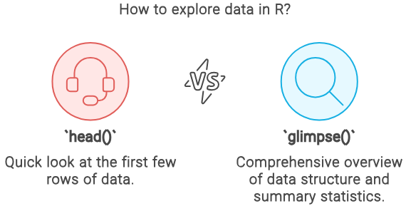
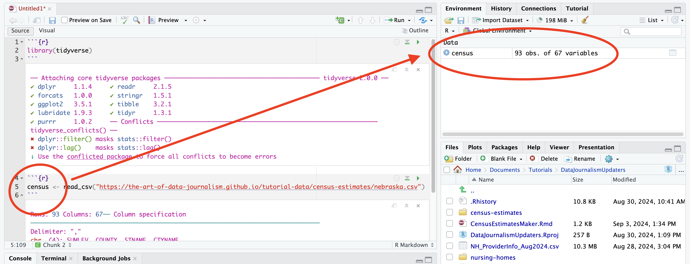
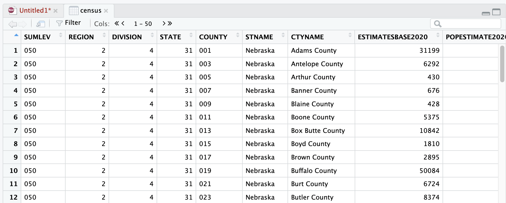
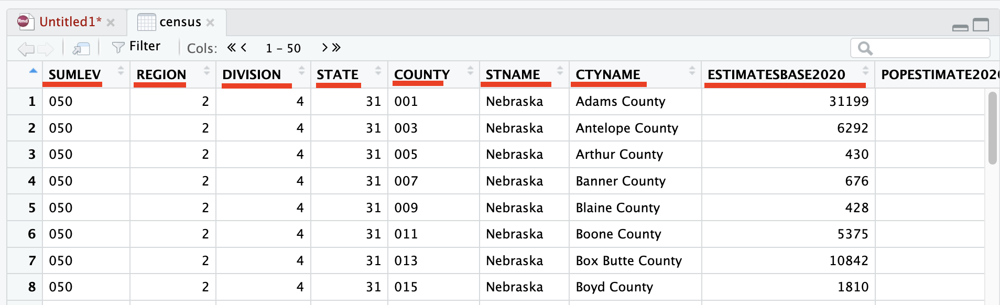
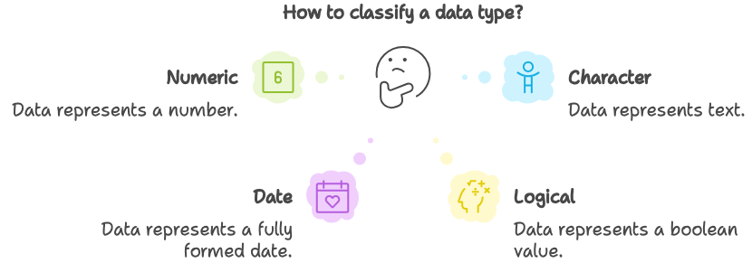

```{r setup, include=FALSE}
library(learnr)
library(gradethis)
library(tidyverse)
library(glue)
knitr::opts_chunk$set(echo = FALSE)
tutorial_options(exercise.completion=FALSE)
```
```{r load-data, message=FALSE, warning=FALSE}
state <- Sys.getenv("tutorial.state")
if(state == "") state <- "NE"

stateName <- read_csv("https://the-art-of-data-journalism.github.io/tutorial-data/states.csv") |> filter(Postal == state) 

stateName <- stateName |> 
  mutate(dataurl = case_when(
    Postal == "AL" ~ paste0("https://the-art-of-data-journalism.github.io/tutorial-data/census-estimates/", str_to_lower(State), ".csv"),
    Postal == "AK" ~ paste0("https://the-art-of-data-journalism.github.io/tutorial-data/census-estimates/", str_to_lower(State), ".csv"),
    Postal == "AZ" ~ paste0("https://the-art-of-data-journalism.github.io/tutorial-data/census-estimates/", str_to_lower(State), ".csv"),
    Postal == "AR" ~ paste0("https://the-art-of-data-journalism.github.io/tutorial-data/census-estimates/", str_to_lower(State), ".csv"),
    Postal == "CA" ~ paste0("https://the-art-of-data-journalism.github.io/tutorial-data/census-estimates/", str_to_lower(State), ".csv"),
    Postal == "CO" ~ paste0("https://the-art-of-data-journalism.github.io/tutorial-data/census-estimates/", str_to_lower(State), ".csv"),
    Postal == "CT" ~ paste0("https://the-art-of-data-journalism.github.io/tutorial-data/census-estimates/", str_to_lower(State), ".csv"),
    Postal == "DE" ~ paste0("https://the-art-of-data-journalism.github.io/tutorial-data/census-estimates/", str_to_lower(State), ".csv"),
    Postal == "FL" ~ paste0("https://the-art-of-data-journalism.github.io/tutorial-data/census-estimates/", str_to_lower(State), ".csv"),
    Postal == "GA" ~ paste0("https://the-art-of-data-journalism.github.io/tutorial-data/census-estimates/", str_to_lower(State), ".csv"),
    Postal == "HI" ~ paste0("https://the-art-of-data-journalism.github.io/tutorial-data/census-estimates/", str_to_lower(State), ".csv"),
    Postal == "ID" ~ paste0("https://the-art-of-data-journalism.github.io/tutorial-data/census-estimates/", str_to_lower(State), ".csv"),
    Postal == "IL" ~ paste0("https://the-art-of-data-journalism.github.io/tutorial-data/census-estimates/", str_to_lower(State), ".csv"),
    Postal == "IN" ~ paste0("https://the-art-of-data-journalism.github.io/tutorial-data/census-estimates/", str_to_lower(State), ".csv"),
    Postal == "IA" ~ paste0("https://the-art-of-data-journalism.github.io/tutorial-data/census-estimates/", str_to_lower(State), ".csv"),
    Postal == "KS" ~ paste0("https://the-art-of-data-journalism.github.io/tutorial-data/census-estimates/", str_to_lower(State), ".csv"),
    Postal == "KY" ~ paste0("https://the-art-of-data-journalism.github.io/tutorial-data/census-estimates/", str_to_lower(State), ".csv"),
    Postal == "LA" ~ paste0("https://the-art-of-data-journalism.github.io/tutorial-data/census-estimates/", str_to_lower(State), ".csv"),
    Postal == "ME" ~ paste0("https://the-art-of-data-journalism.github.io/tutorial-data/census-estimates/", str_to_lower(State), ".csv"),
    Postal == "MD" ~ paste0("https://the-art-of-data-journalism.github.io/tutorial-data/census-estimates/", str_to_lower(State), ".csv"),
    Postal == "MA" ~ paste0("https://the-art-of-data-journalism.github.io/tutorial-data/census-estimates/", str_to_lower(State), ".csv"),
    Postal == "MI" ~ paste0("https://the-art-of-data-journalism.github.io/tutorial-data/census-estimates/", str_to_lower(State), ".csv"),
    Postal == "MN" ~ paste0("https://the-art-of-data-journalism.github.io/tutorial-data/census-estimates/", str_to_lower(State), ".csv"),
    Postal == "MS" ~ paste0("https://the-art-of-data-journalism.github.io/tutorial-data/census-estimates/", str_to_lower(State), ".csv"),
    Postal == "MO" ~ paste0("https://the-art-of-data-journalism.github.io/tutorial-data/census-estimates/", str_to_lower(State), ".csv"),
    Postal == "MT" ~ paste0("https://the-art-of-data-journalism.github.io/tutorial-data/census-estimates/", str_to_lower(State), ".csv"),
    Postal == "NE" ~ paste0("https://the-art-of-data-journalism.github.io/tutorial-data/census-estimates/", str_to_lower(State), ".csv"),
    Postal == "NV" ~ paste0("https://the-art-of-data-journalism.github.io/tutorial-data/census-estimates/", str_to_lower(State), ".csv"),
    Postal == "NH" ~ paste0("https://the-art-of-data-journalism.github.io/tutorial-data/census-estimates/", str_to_lower(State), ".csv"),
    Postal == "NJ" ~ paste0("https://the-art-of-data-journalism.github.io/tutorial-data/census-estimates/", str_to_lower(State), ".csv"),
    Postal == "NM" ~ paste0("https://the-art-of-data-journalism.github.io/tutorial-data/census-estimates/", str_to_lower(State), ".csv"),
    Postal == "NY" ~ paste0("https://the-art-of-data-journalism.github.io/tutorial-data/census-estimates/", str_to_lower(State), ".csv"),
    Postal == "NC" ~ paste0("https://the-art-of-data-journalism.github.io/tutorial-data/census-estimates/", str_to_lower(State), ".csv"),
    Postal == "ND" ~ paste0("https://the-art-of-data-journalism.github.io/tutorial-data/census-estimates/", str_to_lower(State), ".csv"),
    Postal == "OH" ~ paste0("https://the-art-of-data-journalism.github.io/tutorial-data/census-estimates/", str_to_lower(State), ".csv"),
    Postal == "OK" ~ paste0("https://the-art-of-data-journalism.github.io/tutorial-data/census-estimates/", str_to_lower(State), ".csv"),
    Postal == "OR" ~ paste0("https://the-art-of-data-journalism.github.io/tutorial-data/census-estimates/", str_to_lower(State), ".csv"),
    Postal == "PA" ~ paste0("https://the-art-of-data-journalism.github.io/tutorial-data/census-estimates/", str_to_lower(State), ".csv"),
    Postal == "RI" ~ paste0("https://the-art-of-data-journalism.github.io/tutorial-data/census-estimates/", str_to_lower(State), ".csv"),
    Postal == "SC" ~ paste0("https://the-art-of-data-journalism.github.io/tutorial-data/census-estimates/", str_to_lower(State), ".csv"),
    Postal == "SD" ~ paste0("https://the-art-of-data-journalism.github.io/tutorial-data/census-estimates/", str_to_lower(State), ".csv"),
    Postal == "TN" ~ paste0("https://the-art-of-data-journalism.github.io/tutorial-data/census-estimates/", str_to_lower(State), ".csv"),
    Postal == "TX" ~ paste0("https://the-art-of-data-journalism.github.io/tutorial-data/census-estimates/", str_to_lower(State), ".csv"),
    Postal == "UT" ~ paste0("https://the-art-of-data-journalism.github.io/tutorial-data/census-estimates/", str_to_lower(State), ".csv"),
    Postal == "VT" ~ paste0("https://the-art-of-data-journalism.github.io/tutorial-data/census-estimates/", str_to_lower(State), ".csv"),
    Postal == "VA" ~ paste0("https://the-art-of-data-journalism.github.io/tutorial-data/census-estimates/", str_to_lower(State), ".csv"),
    Postal == "WA" ~ paste0("https://the-art-of-data-journalism.github.io/tutorial-data/census-estimates/", str_to_lower(State), ".csv"),
    Postal == "WV" ~ paste0("https://the-art-of-data-journalism.github.io/tutorial-data/census-estimates/", str_to_lower(State), ".csv"),
    Postal == "WI" ~ paste0("https://the-art-of-data-journalism.github.io/tutorial-data/census-estimates/", str_to_lower(State), ".csv"),
    Postal == "WY" ~ paste0("https://the-art-of-data-journalism.github.io/tutorial-data/census-estimates/", str_to_lower(State), ".csv"),
    TRUE ~ "https://the-art-of-data-journalism.github.io/tutorial-data/census-estimates/nebraska.csv"  # Default case if none match
  ))

census <- read_csv(stateName$dataurl)

countyLanguage <- case_when(
  state == "AK" ~ c("county equivalent", "county equivalents"),
  state == "CT" ~ c("planning region", "planning regions"),
  state == "LA" ~ c("parish", "parishes"),
  state == "VA" ~ c("county or city", "counties or cities"),
  TRUE ~ c("county", "counties")
)

nrows <- nrow(census)
ncolumns <- ncol(census)
```

## The Goal

The goal of this lesson is to introduce you to fundamental concepts and terminology related to data in the context of data journalism. By the end of this tutorial, you'll understand the basic structure of datasets, including rows and columns, and how to view and inspect data in R. You'll learn about different data types you'll encounter, how to import data into R, and key functions like `head()` and `glimpse()` for exploring your data.

## What is Data Journalism?

In the last tutorial, data journalism was using data as a source. And in our very computerized present, data is everywhere. Terabytes on terabytes on terabytes of the stuff everywhere. But, like a human source, you need to know if your data actually knows the thing you want to know. Just because you have data doesn't mean you have answers. Just because you have a source doesn't mean that source knows what they're talking about. 

So the first step in data journalism is finding data. Sometimes you can do that on your own -- governments have created open data portals to make it easier. Sometimes you need to ask around -- interview the humans that work at an agency and see what they track and if they have the data. That might require a public records request at the state or local level, or a Freedom of Information Act request at the federal level. Finding and obtaining data is a whole art unto itself, beyond the technical instructions here. 

Step 2 in data journalism is looking at what exactly is in your data. This process is so important that it requires multiple different lessons to come back to the same question: What is in my data? And is it what I need?

"You have to explore the data to understand what questions can you even ask the data to begin with," said MaryJo Webster of the Minneapolis Star Tribune. "What's the knowledge that this source has? What are the fields of information? What's the breadth of knowledge? You know, all the different fields, the columns that might have different variables that will tell you something more deep. How rich is that? How far back in time does the data go? Geographically, is it the entire state? Is it just one county? That's that breadth of knowledge.

"You've got to explore that first to even think about what you could do with it."

## The Basics

Data are everywhere (and data is plural of datum, thus the use of the verb are in that statement). It surrounds you. Every time you use your phone, you are creating data. Lots of it. Your online life. Any time you buy something. It's everywhere. News, like life, is no different. Modernity is drowning in data, and more comes along all the time.

In news, and in this class, we'll be dealing largely with two kinds of data: **event level data and summary data**. It's not hard to envision event level data. A car accident. A crime. A fire. They are the events that make up the whole. Combine them together -- summarize them -- and you'll have some notion of how the year went. What we usually see is summary data -- who wants to scroll through 365 days of crime data to figure out if crime was up or down? 

To start with, we need to understand the shape of data. 

## Getting Data

R is a statistical programming language that is purpose built for data analysis.

Base R does a lot, but there are a mountain of external libraries that do things to make R better/easier/more fully featured. We already installed the Tidyverse -- or you should have if you followed the instructions for the last assignment -- which isn't exactly a library, but a collection of libraries. Together, they make up the 
Tidyverse. Individually, they are extraordinarily useful for what they do. We can load them all at once using the Tidyverse name, or we can load them individually. Let's start with individually.

The two libraries we are going to need for this assignment are `readr` and `dplyr`. The library `readr` reads different types of data in as a dataframe. For this assignment, we're going to read in csv data or Comma Separated Values data. That's data that has a comma between each column of data.

Then we're going to use `dplyr` to analyze it. To use a library, you need to import it. 

<div class="alert alert-info">
  <h4 class="alert-heading">Key Concept</h4>
  <p class="mb-0">Put all your library imports at the top of your notebooks in a single block.</p>
</div>

**Don't do this yet. Read carefully. If you do this in a notebook, I'll know you're not reading.**

Under normal circumstances, to load a single library, you do this:

```         
library(readr)
```

To load two of them, you need to run two lines of code like this:

```         
library(readr)
library(dplyr)
```

**BUT...**

You can keep doing that for as many libraries as you need. I've seen notebooks with 10 or more library imports.

**But the Tidyverse has a neat little trick. We can load most of the libraries we'll need for the whole semester with one line.**

Run this.

```{r load-tidyverse, exercise=TRUE}
library(tidyverse)
```

```{r load-tidyverse-solution}
library(tidyverse)
```

```{r load-tidyverse-check}
grade_this_code()
```

<div class="alert alert-info">
  <h4 class="alert-heading">Key Concept</h4>
  <p class="mb-0">From now on, if that library is not the first line of your notebook, you're probably doing it wrong.</p>
</div>

## Loading Data

The first thing we need to do is get some data to work with. We do that by reading it in. In our case, we're going to read data from a CSV file -- a comma-separated values file. Most of the data we'll use in this class will come from CSV files. 

```{r counties, exercise=FALSE, exercise.eval=TRUE, exercise.setup = "load-data", results='asis'}
glue("The CSV file we're going to read is the same data you used in your last lesson -- Census Population Estimates. But this time, instead of one {countyLanguage[2]} in {stateName$State}, you're going to get all {nrows} of them.") 
```

So step 2, after setting up our libraries, is most often going to be importing data. In order to analyze data, we need data.

The code looks *something* like this:

```         
census <- read_csv("mystate.csv")
```

Let's unpack that.

The first part -- census -- is the **name of your variable**. Remember: A variable is just a name of a thing that stores stuff. In this case, our variable is a data frame, which is R's way of storing data (technically it's a tibble, which is the Tidyverse way of storing data, but the differences aren't important and people use them interchangeably). **We can call this whatever we want, with a few exceptions.** I always want to name data frames after what is in it. In this case, we're going to import a dataset of census estimates. Variable names, by convention are one word all lower case. **You can end a variable with a number, but you can't start one with a number**.

<div class="alert alert-info">
  <h4 class="alert-heading">Key Concept</h4>
  <p class="mb-0">Always give your data a name. Call it what is in the data. One word, all lowercase letters.</p>
</div>

The `<-` bit is the variable assignment operator. It's how we know we're assigning something to a word. Think of the arrow as saying "Take everything on the right of this arrow and stuff it into the thing on the left." So we're creating an empty vessel called `census` and stuffing all this data into it.

<div class="alert alert-info">
  <h4 class="alert-heading">Key Concept</h4>
  <p class="mb-0">The <code><-</code> is what creates the name. The name is to the left. What goes in the name is on the right.</p>
</div>

The `read_csv` bits are pretty obvious, except for one thing. What happens in the quote marks is the path to the data. In there, I have to tell R where it will find the data. The easiest thing to do when you are working on your own computer, if you are confused about how to find your data, is to put your data in the same folder as as your notebook (you'll have to save that notebook first). If you do that, then you just need to put the name of the file in there (filename.csv). For this exercise, we're pulling the data from a website, and the path that we'll enter is the url of the data.

<div class="alert alert-info">
  <h4 class="alert-heading">Key Concept</h4>
  <p class="mb-0">The name of the file goes inside <code>read_csv</code> in quotes.</p>
</div>

Your first task is to import the data. For this exercise, you need to simply run this, filling in your state name where the blank is in all lowercase letters and replacing any spaces with a dash. Examples: `nebraska` and `new-mexico`. 

```{r read, exercise=TRUE, exercise.reveal_solution = FALSE, exercise.setup = "load-data"}
census <- read_csv("https://the-art-of-data-journalism.github.io/tutorial-data/census-estimates/____.csv")
```

```{r read-check}
grade_this({
  if (identical(nrow(.result), nrows)) {
    pass("Great work! You imported your state's estimates.")
  }
  fail()
})
```

If it worked, you'll see a lot of output that describes your data. If it didn't, you'll get a short error message.

### Exercise 1: Using head to see your data

Now we can inspect the data we imported. What does it look like? What's in it? What do we have to work with?

That depends on where we are looking at the data. In the tutorials like this, we have limited tools to see the data. In a notebook, we have more. For now, we'll focus on what we do here in the tutorials.

To see our data, we use the function `head()` and **put the name of the variable we created above between the parenthesis** to show the headers and **the first six rows of data**.

<div class="alert alert-info">
  <h4 class="alert-heading">Key Concept</h4>
  <p class="mb-0"><code>head()</code> only shows you the first six rows.</p>
</div>

```{r head-data, exercise=TRUE, exercise.setup = "load-data"}
head(_____)
```

```{r head-data-solution, exercise.reveal_solution = FALSE}
head(census)
```

```{r head-data-check}
grade_this_code()
```

::: {#head-data-hint}
**Hint:** The thing you need is to the left of a \<- in a block above.
:::

```{r headcounties, exercise=FALSE, exercise.eval=TRUE, exercise.setup = "load-data", results='asis'}
glue("Let's look at this. As you can see by the data, we have six {countyLanguage[2]}, **which is what we expect** from `head()`. But notice the first row -- the headers. We have things like `CTYNAME` and `ESTIMATEBASE2020` at the top. And we have a lot of number columns, showing everything from the population to the number of births and deaths in that place.") 
```

That header row is *incredibly* important for what's to come. When your data is wider than what you can see in the window, you'll see a black triangle on the upper right of the header row. That let's you scroll right to see more.

### Exercise 2: Using glimpse to see your data

There is another way to "see" your data that looks different than a table, but provides important information nonetheless.

Why do this? Why use head? It gives us a glimpse of the data. Which ... conveniently ... is **also** a way to look at your data, and it works the same way as `head()`

```{r glimpse-data, exercise=TRUE, exercise.setup = "load-data"}
glimpse(____)
```

```{r glimpse-data-solution, exercise.reveal_solution = FALSE}
glimpse(census)
```

```{r glimpse-data-check}
grade_this_code()
```

::: {#glimpse-data-hint}
**Hint:** This works the same as head() above.
:::

This time, you get two very important pieces of information immediately on each line -- the name of the column and **what kind of data is in there**. We'll dive into what those mean and why that's important later this lesson.

Why use this over `head()`? Seeing the data itself is sometimes better -- easier to see and understand instinctively -- and sometimes less convenient. Sometimes, what we need is the name of the column, not the data, not anything else. What works best is what works best for you. There's not really a wrong answer on which you should use. 

Either of these will guide you with what you have to work with in the coming problems.

{width="100%"}

## In The Notebook

When you are working in a notebook, you have more tools available to you. The main one to get accustomed to is the Environment tab. When you run `read_csv`, you will see the name of your variable appear in the Environment. You'll also see some information about your data.

{width="100%"}

```{r numbercounties, exercise=FALSE, exercise.eval=TRUE, exercise.setup = "load-data", results='asis'}
glue("What more information? How many rows (or observations) are in your data, and how many columns. So, according to the environment, there are {nrows}, and there are {ncolumns} columns in {stateName$State}. But what does that mean?")
```

## Rows

Data, oversimplifying it a bit, is information organized. Generally speaking, it's organized into rows and columns. Rows, generally, are individual elements. A state. A date. A number. Columns, generally, are components of the data, sometimes called variables or fields. So if each row is a county, the first column might be their state name. The second is what county the data covers. The third could be the population number. And so on. 

Look at this screenshot of the census data for Nebraska. See how each row is a county? That's what rows are. One of a thing. 

{width="100%"}

One of the critical components of data analysis, especially for beginners, is having a mental picture of your data. What does each row mean? What does each column in each row signify? How many rows do you have? How many columns? 

<div class="alert alert-info">
  <h4 class="alert-heading">Key Concept</h4>
  <p class="mb-0">If you want to see your data in a spreadsheet format, double click on the name in the environment.</p>
</div>

## Columns

If your data is properly formed, the first row of your data will be the header row. The header row is the most important row in your data.

<div class="alert alert-info">
  <h4 class="alert-heading">Key Concept</h4>
  <p class="mb-0">An absolutely essential concept you need to understand for the whole course is that **every column has a name**. That name is in the header row, the first row of your data when you are looking at it.</p>
</div>

{width="100%"}

So the names of every county in this dataset are in the `CTYNAME` column. Want to know what county has the most people? You'll need the `POPESTIMATE2023` column. Looking at that first row for those names is something you're going to do over and over again. 

## Types

There are scores of data types in the world, and R has them. In this class, we're primarily going to be dealing with dataframes, and each element of our dataframes will have a data type.

Typically, they'll be one of four types of data:

* Numeric: a number, like the number of people in a place or dollars in the budget.
* Character: Text, like a name, a county, a type
* Date: Fully formed dates -- 2019-01-01 -- have a special date type. Elements of a date, like a year (ex. 2019) are not technically dates, so they'll appear as numeric data types. 
* Logical: Rare, but every now and then we'll have a data type that's Yes or No, True or False, etc.

**Question:** Is a zip code a number? Is a phone number a number? Trick question, because the answer is no. Numbers are things we do math on. Can you add two phone numbers together? If the thing you want is not something you're going to do math on, then make it a character type. If you don't, most every software system on the planet will drop leading zeros. For example, every zip code in Boston starts with 0. If you record that as a number, your zip code will become a four digit number, which isn't a zip code anymore. 

{width="100%"}

## Recap

In this lesson, you've learned essential concepts for working with data in R. We covered how to import data using read_csv(), and explored ways to inspect your data using head() and glimpse(). You now understand that data are typically organized into rows (individual elements like players) and columns (variables or attributes). We discussed the importance of the header row in naming your columns, which is crucial for data manipulation. You've also been introduced to common data types you'll encounter: numeric, character, date, and logical. Remember, always start by loading the Tidyverse library, give your imported data a descriptive name, and take time to understand the structure of your dataset. These foundational skills will be vital as you progress in your data analysis journey.

## Terms To Know

- `read_csv()`: Function used to import CSV data into R
- Dataframe: R's primary structure for storing tabular data
- `head()`: Function to view the first six rows of a dataset
- `glimpse()`: Function that provides a concise summary of a dataset's structure
- Tidyverse: A collection of R packages designed for data science workflows
