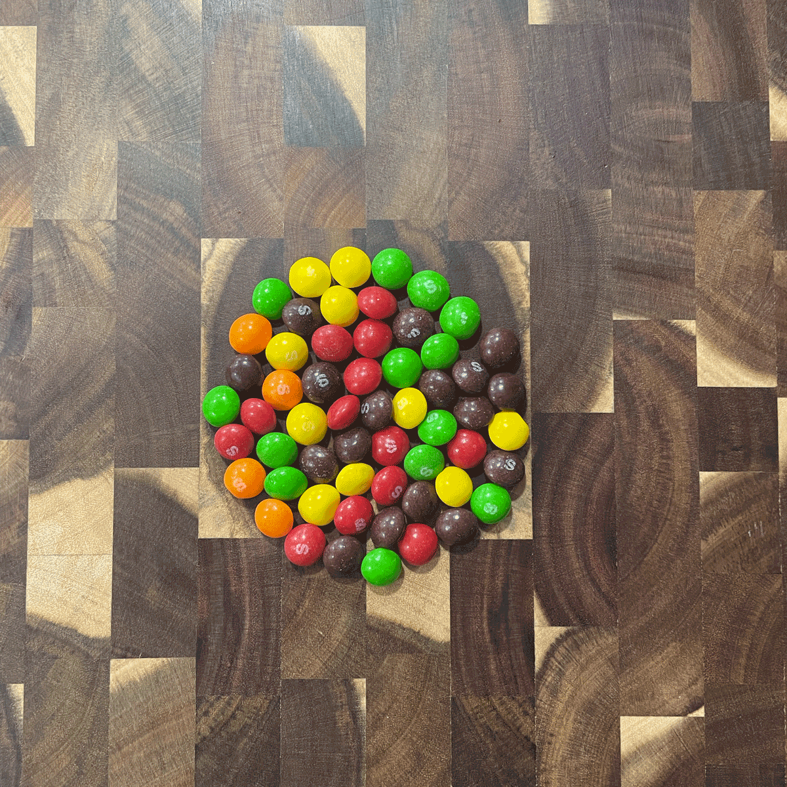
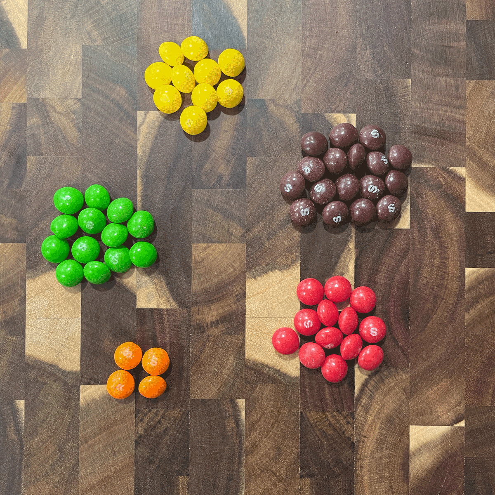
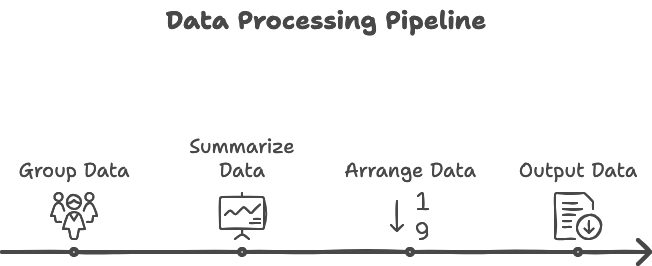

```{r setup, include=FALSE}
library(learnr)
library(gradethis)
library(tidyverse)
library(glue)
knitr::opts_chunk$set(echo = FALSE)
tutorial_options(exercise.completion=FALSE)
```
```{r load-data, message=FALSE, warning=FALSE}
state <- Sys.getenv("tutorial.state")
if(state == "") state <- "NE"

stateName <- read_csv("https://the-art-of-data-journalism.github.io/tutorial-data/states.csv") |> filter(Postal == state) 

stateName <- stateName |> 
  mutate(dataurl = case_when(
    Postal == "AL" ~ paste0("https://the-art-of-data-journalism.github.io/tutorial-data/nursing-homes/", str_to_lower(State), ".csv"),
    Postal == "AK" ~ paste0("https://the-art-of-data-journalism.github.io/tutorial-data/nursing-homes/", str_to_lower(State), ".csv"),
    Postal == "AZ" ~ paste0("https://the-art-of-data-journalism.github.io/tutorial-data/nursing-homes/", str_to_lower(State), ".csv"),
    Postal == "AR" ~ paste0("https://the-art-of-data-journalism.github.io/tutorial-data/nursing-homes/", str_to_lower(State), ".csv"),
    Postal == "CA" ~ paste0("https://the-art-of-data-journalism.github.io/tutorial-data/nursing-homes/", str_to_lower(State), ".csv"),
    Postal == "CO" ~ paste0("https://the-art-of-data-journalism.github.io/tutorial-data/nursing-homes/", str_to_lower(State), ".csv"),
    Postal == "CT" ~ paste0("https://the-art-of-data-journalism.github.io/tutorial-data/nursing-homes/", str_to_lower(State), ".csv"),
    Postal == "DE" ~ paste0("https://the-art-of-data-journalism.github.io/tutorial-data/nursing-homes/", str_to_lower(State), ".csv"),
    Postal == "FL" ~ paste0("https://the-art-of-data-journalism.github.io/tutorial-data/nursing-homes/", str_to_lower(State), ".csv"),
    Postal == "GA" ~ paste0("https://the-art-of-data-journalism.github.io/tutorial-data/nursing-homes/", str_to_lower(State), ".csv"),
    Postal == "HI" ~ paste0("https://the-art-of-data-journalism.github.io/tutorial-data/nursing-homes/", str_to_lower(State), ".csv"),
    Postal == "ID" ~ paste0("https://the-art-of-data-journalism.github.io/tutorial-data/nursing-homes/", str_to_lower(State), ".csv"),
    Postal == "IL" ~ paste0("https://the-art-of-data-journalism.github.io/tutorial-data/nursing-homes/", str_to_lower(State), ".csv"),
    Postal == "IN" ~ paste0("https://the-art-of-data-journalism.github.io/tutorial-data/nursing-homes/", str_to_lower(State), ".csv"),
    Postal == "IA" ~ paste0("https://the-art-of-data-journalism.github.io/tutorial-data/nursing-homes/", str_to_lower(State), ".csv"),
    Postal == "KS" ~ paste0("https://the-art-of-data-journalism.github.io/tutorial-data/nursing-homes/", str_to_lower(State), ".csv"),
    Postal == "KY" ~ paste0("https://the-art-of-data-journalism.github.io/tutorial-data/nursing-homes/", str_to_lower(State), ".csv"),
    Postal == "LA" ~ paste0("https://the-art-of-data-journalism.github.io/tutorial-data/nursing-homes/", str_to_lower(State), ".csv"),
    Postal == "ME" ~ paste0("https://the-art-of-data-journalism.github.io/tutorial-data/nursing-homes/", str_to_lower(State), ".csv"),
    Postal == "MD" ~ paste0("https://the-art-of-data-journalism.github.io/tutorial-data/nursing-homes/", str_to_lower(State), ".csv"),
    Postal == "MA" ~ paste0("https://the-art-of-data-journalism.github.io/tutorial-data/nursing-homes/", str_to_lower(State), ".csv"),
    Postal == "MI" ~ paste0("https://the-art-of-data-journalism.github.io/tutorial-data/nursing-homes/", str_to_lower(State), ".csv"),
    Postal == "MN" ~ paste0("https://the-art-of-data-journalism.github.io/tutorial-data/nursing-homes/", str_to_lower(State), ".csv"),
    Postal == "MS" ~ paste0("https://the-art-of-data-journalism.github.io/tutorial-data/nursing-homes/", str_to_lower(State), ".csv"),
    Postal == "MO" ~ paste0("https://the-art-of-data-journalism.github.io/tutorial-data/nursing-homes/", str_to_lower(State), ".csv"),
    Postal == "MT" ~ paste0("https://the-art-of-data-journalism.github.io/tutorial-data/nursing-homes/", str_to_lower(State), ".csv"),
    Postal == "NE" ~ paste0("https://the-art-of-data-journalism.github.io/tutorial-data/nursing-homes/", str_to_lower(State), ".csv"),
    Postal == "NV" ~ paste0("https://the-art-of-data-journalism.github.io/tutorial-data/nursing-homes/", str_to_lower(State), ".csv"),
    Postal == "NH" ~ paste0("https://the-art-of-data-journalism.github.io/tutorial-data/nursing-homes/", str_to_lower(State), ".csv"),
    Postal == "NJ" ~ paste0("https://the-art-of-data-journalism.github.io/tutorial-data/nursing-homes/", str_to_lower(State), ".csv"),
    Postal == "NM" ~ paste0("https://the-art-of-data-journalism.github.io/tutorial-data/nursing-homes/", str_to_lower(State), ".csv"),
    Postal == "NY" ~ paste0("https://the-art-of-data-journalism.github.io/tutorial-data/nursing-homes/", str_to_lower(State), ".csv"),
    Postal == "NC" ~ paste0("https://the-art-of-data-journalism.github.io/tutorial-data/nursing-homes/", str_to_lower(State), ".csv"),
    Postal == "ND" ~ paste0("https://the-art-of-data-journalism.github.io/tutorial-data/nursing-homes/", str_to_lower(State), ".csv"),
    Postal == "OH" ~ paste0("https://the-art-of-data-journalism.github.io/tutorial-data/nursing-homes/", str_to_lower(State), ".csv"),
    Postal == "OK" ~ paste0("https://the-art-of-data-journalism.github.io/tutorial-data/nursing-homes/", str_to_lower(State), ".csv"),
    Postal == "OR" ~ paste0("https://the-art-of-data-journalism.github.io/tutorial-data/nursing-homes/", str_to_lower(State), ".csv"),
    Postal == "PA" ~ paste0("https://the-art-of-data-journalism.github.io/tutorial-data/nursing-homes/", str_to_lower(State), ".csv"),
    Postal == "RI" ~ paste0("https://the-art-of-data-journalism.github.io/tutorial-data/nursing-homes/", str_to_lower(State), ".csv"),
    Postal == "SC" ~ paste0("https://the-art-of-data-journalism.github.io/tutorial-data/nursing-homes/", str_to_lower(State), ".csv"),
    Postal == "SD" ~ paste0("https://the-art-of-data-journalism.github.io/tutorial-data/nursing-homes/", str_to_lower(State), ".csv"),
    Postal == "TN" ~ paste0("https://the-art-of-data-journalism.github.io/tutorial-data/nursing-homes/", str_to_lower(State), ".csv"),
    Postal == "TX" ~ paste0("https://the-art-of-data-journalism.github.io/tutorial-data/nursing-homes/", str_to_lower(State), ".csv"),
    Postal == "UT" ~ paste0("https://the-art-of-data-journalism.github.io/tutorial-data/nursing-homes/", str_to_lower(State), ".csv"),
    Postal == "VT" ~ paste0("https://the-art-of-data-journalism.github.io/tutorial-data/nursing-homes/", str_to_lower(State), ".csv"),
    Postal == "VA" ~ paste0("https://the-art-of-data-journalism.github.io/tutorial-data/nursing-homes/", str_to_lower(State), ".csv"),
    Postal == "WA" ~ paste0("https://the-art-of-data-journalism.github.io/tutorial-data/nursing-homes/", str_to_lower(State), ".csv"),
    Postal == "WV" ~ paste0("https://the-art-of-data-journalism.github.io/tutorial-data/nursing-homes/", str_to_lower(State), ".csv"),
    Postal == "WI" ~ paste0("https://the-art-of-data-journalism.github.io/tutorial-data/nursing-homes/", str_to_lower(State), ".csv"),
    Postal == "WY" ~ paste0("https://the-art-of-data-journalism.github.io/tutorial-data/nursing-homes/", str_to_lower(State), ".csv"),
    TRUE ~ "https://the-art-of-data-journalism.github.io/tutorial-data/nursing-homes/nebraska.csv"  # Default case if none match
  ))

homes <- read_csv(stateName$dataurl)

countyLanguage <- case_when(
  state == "AK" ~ c("county equivalent", "county equivalents"),
  state == "CT" ~ c("planning region", "planning regions"),
  state == "LA" ~ c("parish", "parishes"),
  state == "VA" ~ c("county or city", "counties or cities"),
  TRUE ~ c("county", "counties")
)

nrows <- nrow(homes)
ncolumns <- ncol(homes)

most <- homes |>
  group_by(county_parish) |>
  summarise(
    total = n()
  ) |> 
  arrange(desc(total)) |> 
  slice(1)

mostrated <- homes |>
  group_by(county_parish, overall_rating) |>
  summarise(
    total = n()
  ) |> 
  ungroup() |> 
  arrange(desc(total)) |> 
  slice(1)
```
## The Goal

```{r intro, exercise=FALSE, exercise.eval=TRUE, exercise.setup = "load-data", results='asis'}
glue("The goal of this lesson is to introduce you to one of the most fundamental and powerful concepts in data analysis: aggregation. You'll learn how to take large datasets with many individual records and summarize them into meaningful insights. We'll focus on using the group_by() and summarize() functions from the dplyr package to group similar items together and calculate totals. By the end of this lesson, you'll be able to answer questions about the {nrows} nursing homes in {stateName$State}, but the techniques you learn can be applied to any subject or dataset.") 
```

## What is Data Journalism?

So far, in our philosophical discussion of data journalism, we've talked about how it's interviewing data as a source, and one of your first steps is just knowing what is in your data. What does it look like? Now we're going to take our first steps -- a giant leap, really -- into asking your data questions and getting answers. It's one of the most powerful calculations you can do as a data journalist. 

Count things.

No really. 

"Ninety percent of what I do is counting things," said MaryJo Webster of the Star Tribune. "And so, to me, you could kind of think back to when you were a child and you were playing with a set of blocks or maybe Legos and you counted out how many blue ones do I have,
how many red ones do I have. That is kind of what I do every day."

So what kind of stories can you do with that?

"How many car crashes there were and how many were in this county versus that county?" she said. "How many were this year versus that year? Very simple count. You're just counting."

It's hard to explain to people who have never worked with data how important the simple act of counting is. Almost every data story you will ever work on will have a count in them -- either one you will do or one done for you before you get the data. Almost every data story can be summarized into a few questions:

- How many of this thing are there where I live?
- How many of those things were there last year? Or five years ago?
- How does that many things compare to my state? The nation?
- Why is there that many or that few of these things?
- When I count up all the things, there aren't any in this place. Why?

There are, of course, more questions to ask of data. And we'll get to those. But a shocking amount of data journalism starts with a simple count. How many of these things are there compared to this other thing? 

So let's start there.

## The Basics

R is a statistical programming language that is purpose built for data analysis.

One of the most basic bits of data analysis is just simply taking a lot of things -- hundreds, thousands, millions of things -- and putting them together somehow. Rarely ever do we want just one number. I'll give you an example: Let's pretend for a second that we have Spotify's data. We have every song streamed in a year. **Billions** of records. Do we want to just count them up? One number? Is your annual Spotify Wrapped just one number that's the total number of streams everyone played in a year? No, of course not. 

It's streams -- but put in groups. You, a user, are a group. How many songs did you play? How many times? What artists? What genres? And on and on. And with each group, we get a different number. An interesting number. A useful number. 

So how do you put things together?

First, we need to load our libraries. 

Run this.

```{r load-tidyverse, exercise=TRUE}
library(tidyverse)
```

```{r load-tidyverse-solution}
library(tidyverse)
```

```{r load-tidyverse-check}
grade_this_code()
```

Now, let's use a dataset that may not be interesting to you now -- because you're young -- but it's a critical public policy issue in the United States: Nursing homes. Quite simply, there aren't enough of them. And in some places, there aren't any at all, in spite of there being old people to take care of in those places. The number of nursing homes in your state -- and where they are in your state -- is a major issue that directly affects families all around you. 

For this exercise, you need to simply run this, filling in your state name where the blank is in all lowercase letters and replacing any spaces with a dash. Examples: `nebraska` and `new-mexico`. 

```{r read, exercise=TRUE, exercise.reveal_solution = FALSE, exercise.setup = "load-data"}
homes <- read_csv("https://the-art-of-data-journalism.github.io/tutorial-data/nursing-homes/____.csv")
```

```{r read-check}
grade_this({
  if (identical(nrow(.result), nrows)) {
    pass("Great work! You imported your state's nursing homes")
  }
  fail()
})
```

### Exercise 1: Using head to see your data

Now we can inspect the data we imported. What does it look like? What's in it? What do we have to work with?

To do that, we use `head()` and **put the name of the variable we created above between the parenthesis** to show the headers and **the first six rows of data**.

```{r head-data, exercise=TRUE, exercise.setup = "load-data"}
head(_____)
```

```{r head-data-solution, exercise.reveal_solution = FALSE}
head(homes)
```

```{r head-data-check}
grade_this_code()
```

::: {#head-data-hint}
**Hint:** The thing you need is to the left of a \<- in a block above.
:::

Let's look at this. As you can see by the data, we have six nursing homes, **which is what we expect** from `head()`. But notice the first row -- the headers. That is where most of the answers you are going to need are going to come from. You can see things like the `provider_name` and their address. If you scroll to the right, you'll find more data -- like their phone number, which is interesting for reporting purposes. You'll see a column called `county_parish` that we're going to use to find where these nursing homes are. You can keep scrolling right for a long time -- there's 103 columns in the data. Which might seem like a lot, but there are datasets with *thousands* of columns and millions of rows.  

## Answering questions with code

```{r numberhomes, exercise=FALSE, exercise.eval=TRUE, exercise.setup = "load-data", results='asis'}
glue("There are {format(nrows, big.mark=",",scientific=FALSE)} nursing homes in {stateName$State} as of the June 2024 data from the national Center for Medicare and Medicaid Studies. I suppose if we were writing about nursing homes in {stateName$State} that's useful information, but it doesn't tell us much. Let's explore more.")
```

**The secret to writing code is that much of it is a pattern.** The building blocks largely stay the same. With the tidyverse, this is *especially* true.

To accomplish our goal, we start with the name of the data we created before. The same name we used in `head()` and `glipse()`. We'll take that data and we'll introduce a new operator: `|>`. The best way to read that operator, in my opinion, is to interpret that as "and then do this." So the start of our pattern is `data |>` which you can read as `data and now we'll do this`.

Then, the `dplyr` library, which we loaded when we loaded up the tidyverse, has a **`group_by`** function in it that does just what we've been talking about -- take your data, put each row into groups. This thing here together, those things over there together. A massive amount of data analysis involves grouping like things together at some point.

It's important to understand in your mind what `group_by()` is doing. It might be easiest to think about it like a package of Skittles candy. Your data, when you first get it, is like a pack of Skittles -- all mixed up. What `group_by` does is puts the candy in little piles. Here's an bag of Skittles dumped out.

{width="100%"}

Now, using `group_by`, we can put them into piles. With Skittles, we group them by color. With data, we could do this with any column of data -- dates, locations, types, ratings and so on. The list is endless. But notice -- all of those things are not numbers. With the exception of dates, they're names or labels or text of some variety. Rarely ever will you group something by a number.

{alt="Grouped data" width="100%"}

Like `head()` and `glimpse()`, **we need to put something in the parenthesis in group_by()**. But unlike `head()` and `glimpse()`, this time the something comes from that **first row of our data**. We are grouping data by one of the pieces of the data -- a field, or column. *If we're trying to group by county or parish*, which field or column in our data looks like it holds that information? Let's use head again and take a look at the very top row in bold.

<div class="alert alert-info">
  <h4 class="alert-heading">Key Concept</h4>
  <p class="mb-0">A column name -- and only a column name -- can go in <code>group_by</code>.</p>
</div>

To know what we're going to use in `group_by`, we need to take another peek at our data. We'll do this here so we have those column names to refer to in the code blocks coming up. 

```{r head-review, exercise=TRUE, exercise.setup = "load-data"}
head(____)
```

```{r head-review-solution, exercise.reveal_solution = FALSE}
head(homes)
```

```{r head-review-check}
grade_this_code()
```

That block of code you just ran has two hints for the code block you'll have to complete later: What data are you using? What column in that data do you want to group by? Keep those in mind.

### Exercise 2: Group by and count

After we group our data together by the thing we want to group it by, we need to count how many things are in each group. We do that first by saying we want to summarize our data (a count is a part of a summary). To get a summary, we have to tell it what we want to summarize. So in this case, we want a count. To get that, let's create a thing called total and set it equal to n(), which is the way `dplyr` counts something.

Here's the pattern. **You fill in where there are blanks.** What you fill in are the two hints from above.

```{r group-by, exercise=TRUE, exercise.setup = "load-data", message=FALSE}
____ |>
  group_by(____) |>
  summarise(
    total = n()
  ) 
```

```{r group-by-solution, exercise.reveal_solution = FALSE}
homes |>
  group_by(county_parish) |>
  summarise(
    total = n()
  ) 
```

```{r group-by-check}
grade_this_code()
```

::: {#group-by-hint}
**Hint:** The name of your data -- the first thing you need -- is the same as what you used in `head()` and `glimpse()`. Then, look carefully at the first row of the output of head. What you need is in bold at the top. It's a column name.
:::

```{r review, exercise=FALSE, exercise.eval=TRUE, exercise.setup = "load-data", results='asis'}
glue("In this case, we wanted to group together locations, signified by the field name `county_parish`. After we group the data, we need to count them up. Inside the parentheses in summarize, we set up the summaries we want. In this case, we just want a count of the {countyLanguage[2]}: `total = n()` says create a new field, called `total` and set it equal to `n()`, which might look weird, but it's common in stats. The number of things in a dataset? Statisticians call in n. There are n number of nursing homes in this dataset. So `n()` is a function that counts the number of things there are.")
```

### Exercise 3: Arranging data

```{r arrangepreamble, exercise=FALSE, exercise.eval=TRUE, exercise.setup = "load-data", results='asis'}
glue("And when we run that, we get a list of {countyLanguage[2]} with a count next to them. But it's in alphabetical order. That doesn't help us much. Usually we want to know where the most or the least are. So we'll add another And Then Do This `|>` and use `arrange`. Arrange does what you think it does -- it arranges data in order. By default, it's in ascending order -- smallest to largest. But if we want to know the {countyLanguage[1]} with the most homes, we need to sort it in descending order. In arrange, we need to tell it what we are arranging by. **If you have group_by, then whatever you are arranging by will *always* come from inside summarize.** The pattern looks like this:")
```

```{r group-by-2, exercise=TRUE, exercise.setup = "load-data", message=FALSE}
homes |>
  group_by(____) |>
  summarise(
    total = n()
  ) |> 
  arrange(desc(____))
```

```{r group-by-2-solution, exercise.reveal_solution = FALSE}
homes |>
  group_by(county_parish) |>
  summarise(
    total = n()
  ) |> 
  arrange(desc(total))
```

```{r group-by-2-check}
grade_this_code()
```

::: {#group-by-2-hint}
**Hint:** The only thing new here is the arrange, and what goes in arrange comes from summarize, and it isn't the n() parts.
:::

```{r arrangeresult, exercise=FALSE, exercise.eval=TRUE, exercise.setup = "load-data", results='asis'}
glue("And when we run that, you'll see that {most$county_parish} has the most nursing homes with {most$total}. But let me guess -- without knowing anything about your state, I bet you that {most$county_parish} just happens to be the most populated in {stateName$State}. We'll cover this again and again, but here's your first warning: be careful that what you're looking at isn't just a population map. In this case, it's just an example of a pattern of code we'll use over and over again. It is not news that {most$county_parish} has the most nursing homes.")
```

### Exercise 4: Grouping by more than one thing

We can, if we want, group by more than one thing. One of the most popular uses of this data is to compare nursing homes -- the federal government has created a 5-star rating system, where 5 is the best and 1 is not. In the data you have, that rating is in the `overall_rating` column. So what if we looked at the ratings for each home in each county? 

The hint here is **each**. Any time you hear an editor or a reporter or someone say **each**, it probably means there's a group by involved. **Each** county with **each** rating means there's two! 

```{r group-by-3, exercise=TRUE, exercise.setup = "load-data", message=FALSE}
homes |>
  group_by(____, ____) |>
  summarise(
    total = n()
  ) |> 
  arrange(desc(____))
```

```{r group-by-3-solution, exercise.reveal_solution = FALSE}
homes |>
  group_by(county_parish, overall_rating) |>
  summarise(
    total = n()
  ) |> 
  arrange(desc(total))
```

```{r group-by-3-check}
grade_this_code()
```

::: {#group-by-3-hint}
**Hint:** If you're reading this, you're going too fast. I told you what to put in group_by in the sentences above this code window. I will do that a lot in these tutorials. Get used to reading carefully. Hints are EVERYWHERE.
:::


```{r doubleresult, exercise=FALSE, exercise.eval=TRUE, exercise.setup = "load-data", results='asis'}
glue("Now there's a ton to look at here. But what does it mean? If you haven't looked at a lot of data before, it might not be immediately intuitive. Let's take the first row. What that says is {mostrated$county_parish} had {mostrated$total} homes with a {mostrated$overall_rating}-star rating. See how the columns are arranged? It's the first column in our group_by, followed by the second, and then the total we created in the summarize. Which is the order you come to them when you read the code. Logical, eh?")
```

That first row might be interesting, it might not be. A few rows down, you might find a smaller county with a lot of 5-star homes for its size. Or the opposite -- a smaller county with a lot of low-rated homes. Every state has economic and cultural reasons for just about everything that goes on there. Apply what you know about your state to that list, and stories will start popping into your head. 

<div class="alert alert-warning"> 
<h4 class="alert-heading">Common Mistake</h4> 
<p class="mb-0">Remember earlier when I said we'd rarely ever group by a number? Didn't we just do that? Yes, but ... Remember a number is only a number if you would do math on it. Is a 5-Star Rating system a number? Yes! And No! We will do math on it, but it's also a label too. A critical skill in data journalism is using logic and common sense, not rigid rules that something will <i>always</i> be this way or that.</p>
</div>

## If all you need is a count ... 

Grouping and counting is such a common thing that there's multiple shortcuts to it in R. In the Tidyverse specifically, there's a shortcut called `tally()` that just counts things up in groups. If all you need is a count, it's a time saver. If, as you'll learn in the next tutorial, you need more than just a count, `tally()` is the wrong call. 

Let's redo our count by `county_parish` from exercise 2 and 3. First, we'll just count them. Then, we'll use a shortcut in tally to arrange them with less code. 

### Exercise 5: Tally

```{r group-by-4, exercise=TRUE, exercise.setup = "load-data", message=FALSE}
homes |>
  group_by(____) |>
  tally()
```

```{r group-by-4-solution, exercise.reveal_solution = FALSE}
homes |>
  group_by(county_parish) |>
  tally()
```

```{r group-by-4-check}
grade_this_code()
```

As you can see -- very similar results to exercise 2, except this time, instead of total, our count of homes is called n. But what if you want them arranged? You could add an arrange here like you did before. But the developers of tally knew you wanted to do that -- everyone does -- so they added a shortcut in tally to help you. In `tally()`, you just need to set a sort equal to TRUE -- all caps. What that means is yes, I want it sorted.

### Exercise 6: Tally, but arranged this time

```{r group-by-5, exercise=TRUE, exercise.setup = "load-data", message=FALSE}
homes |>
  group_by(____) |>
  tally(sort=____)
```

```{r group-by-5-solution, exercise.reveal_solution = FALSE}
homes |>
  group_by(county_parish) |>
  tally(sort=TRUE)
```

```{r group-by-5-check}
grade_this_code()
```

## The Recap

In this lesson, we've explored the fundamental process of data aggregation using R and the Tidyverse. We learned how to use group_by() to organize our data into meaningful categories, such as player positions or teams. We then used summarise() to calculate various statistics for these groups, starting with counts. We also practiced arranging our results to highlight the most significant findings. 

The most important bit to remember is that analyzing data in the Tidyverse is a pattern. That pattern goes `data |> function |> function |> function |> output`. Or, put another way:

{width="100%"}

Remember, the power of this approach lies in its flexibility and scalability - the same basic pattern of grouping, summarizing, and arranging can be applied to datasets of any size and complexity. Whether you're analyzing a single city's crime data or billions of Spotify streams, these tools form the foundation of data analysis.

## Terms to Know

- **Aggregation**: The process of combining multiple data points into a single summary statistic or result.
- **group_by()**: A function in dplyr that separates data into groups based on one or more variables, allowing for subsequent operations to be performed on each group independently.
- **summarise()** (or summarize()): A function that computes summary statistics for a dataset, often used after group_by() to calculate results for each group.
- **arrange()**: A function used to order rows in a dataset based on values in specified columns, either in ascending (default) or descending order.
- **desc()**: A function used within arrange() to specify descending order for sorting.
- **n()**: A function used within summarise() to count the number of rows in each group.
- **Pipe operator** (|>): A symbol used in R to chain together multiple operations, allowing you to read code from left to right and top to bottom.
