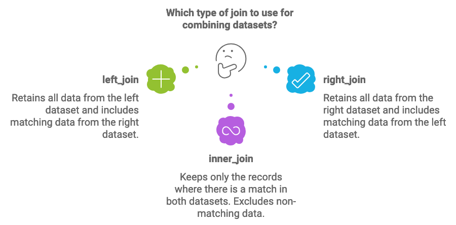

```{r setup, include=FALSE}
library(learnr)
library(gradethis)
library(tidyverse)
library(glue)
knitr::opts_chunk$set(echo = FALSE)
tutorial_options(exercise.completion=FALSE)
```
```{r load-data, message=FALSE, warning=FALSE}
state <- Sys.getenv("tutorial.state")
if(state == "") state <- "NE"

stateName <- read_csv("https://the-art-of-data-journalism.github.io/tutorial-data/states.csv") |> filter(Postal == state) 

stateName <- stateName |> 
  mutate(dataurl = case_when(
    Postal == "AL" ~ paste0("https://the-art-of-data-journalism.github.io/tutorial-data/fatal-accidents/", str_to_lower(State), "-accidents.csv"),
    Postal == "AK" ~ paste0("https://the-art-of-data-journalism.github.io/tutorial-data/fatal-accidents/", str_to_lower(State), "-accidents.csv"),
    Postal == "AZ" ~ paste0("https://the-art-of-data-journalism.github.io/tutorial-data/fatal-accidents/", str_to_lower(State), "-accidents.csv"),
    Postal == "AR" ~ paste0("https://the-art-of-data-journalism.github.io/tutorial-data/fatal-accidents/", str_to_lower(State), "-accidents.csv"),
    Postal == "CA" ~ paste0("https://the-art-of-data-journalism.github.io/tutorial-data/fatal-accidents/", str_to_lower(State), "-accidents.csv"),
    Postal == "CO" ~ paste0("https://the-art-of-data-journalism.github.io/tutorial-data/fatal-accidents/", str_to_lower(State), "-accidents.csv"),
    Postal == "CT" ~ paste0("https://the-art-of-data-journalism.github.io/tutorial-data/fatal-accidents/", str_to_lower(State), "-accidents.csv"),
    Postal == "DE" ~ paste0("https://the-art-of-data-journalism.github.io/tutorial-data/fatal-accidents/", str_to_lower(State), "-accidents.csv"),
    Postal == "FL" ~ paste0("https://the-art-of-data-journalism.github.io/tutorial-data/fatal-accidents/", str_to_lower(State), "-accidents.csv"),
    Postal == "GA" ~ paste0("https://the-art-of-data-journalism.github.io/tutorial-data/fatal-accidents/", str_to_lower(State), "-accidents.csv"),
    Postal == "HI" ~ paste0("https://the-art-of-data-journalism.github.io/tutorial-data/fatal-accidents/", str_to_lower(State), "-accidents.csv"),
    Postal == "ID" ~ paste0("https://the-art-of-data-journalism.github.io/tutorial-data/fatal-accidents/", str_to_lower(State), "-accidents.csv"),
    Postal == "IL" ~ paste0("https://the-art-of-data-journalism.github.io/tutorial-data/fatal-accidents/", str_to_lower(State), "-accidents.csv"),
    Postal == "IN" ~ paste0("https://the-art-of-data-journalism.github.io/tutorial-data/fatal-accidents/", str_to_lower(State), "-accidents.csv"),
    Postal == "IA" ~ paste0("https://the-art-of-data-journalism.github.io/tutorial-data/fatal-accidents/", str_to_lower(State), "-accidents.csv"),
    Postal == "KS" ~ paste0("https://the-art-of-data-journalism.github.io/tutorial-data/fatal-accidents/", str_to_lower(State), "-accidents.csv"),
    Postal == "KY" ~ paste0("https://the-art-of-data-journalism.github.io/tutorial-data/fatal-accidents/", str_to_lower(State), "-accidents.csv"),
    Postal == "LA" ~ paste0("https://the-art-of-data-journalism.github.io/tutorial-data/fatal-accidents/", str_to_lower(State), "-accidents.csv"),
    Postal == "ME" ~ paste0("https://the-art-of-data-journalism.github.io/tutorial-data/fatal-accidents/", str_to_lower(State), "-accidents.csv"),
    Postal == "MD" ~ paste0("https://the-art-of-data-journalism.github.io/tutorial-data/fatal-accidents/", str_to_lower(State), "-accidents.csv"),
    Postal == "MA" ~ paste0("https://the-art-of-data-journalism.github.io/tutorial-data/fatal-accidents/", str_to_lower(State), "-accidents.csv"),
    Postal == "MI" ~ paste0("https://the-art-of-data-journalism.github.io/tutorial-data/fatal-accidents/", str_to_lower(State), "-accidents.csv"),
    Postal == "MN" ~ paste0("https://the-art-of-data-journalism.github.io/tutorial-data/fatal-accidents/", str_to_lower(State), "-accidents.csv"),
    Postal == "MS" ~ paste0("https://the-art-of-data-journalism.github.io/tutorial-data/fatal-accidents/", str_to_lower(State), "-accidents.csv"),
    Postal == "MO" ~ paste0("https://the-art-of-data-journalism.github.io/tutorial-data/fatal-accidents/", str_to_lower(State), "-accidents.csv"),
    Postal == "MT" ~ paste0("https://the-art-of-data-journalism.github.io/tutorial-data/fatal-accidents/", str_to_lower(State), "-accidents.csv"),
    Postal == "NE" ~ paste0("https://the-art-of-data-journalism.github.io/tutorial-data/fatal-accidents/", str_to_lower(State), "-accidents.csv"),
    Postal == "NV" ~ paste0("https://the-art-of-data-journalism.github.io/tutorial-data/fatal-accidents/", str_to_lower(State), "-accidents.csv"),
    Postal == "NH" ~ paste0("https://the-art-of-data-journalism.github.io/tutorial-data/fatal-accidents/", str_to_lower(State), "-accidents.csv"),
    Postal == "NJ" ~ paste0("https://the-art-of-data-journalism.github.io/tutorial-data/fatal-accidents/", str_to_lower(State), "-accidents.csv"),
    Postal == "NM" ~ paste0("https://the-art-of-data-journalism.github.io/tutorial-data/fatal-accidents/", str_to_lower(State), "-accidents.csv"),
    Postal == "NY" ~ paste0("https://the-art-of-data-journalism.github.io/tutorial-data/fatal-accidents/", str_to_lower(State), "-accidents.csv"),
    Postal == "NC" ~ paste0("https://the-art-of-data-journalism.github.io/tutorial-data/fatal-accidents/", str_to_lower(State), "-accidents.csv"),
    Postal == "ND" ~ paste0("https://the-art-of-data-journalism.github.io/tutorial-data/fatal-accidents/", str_to_lower(State), "-accidents.csv"),
    Postal == "OH" ~ paste0("https://the-art-of-data-journalism.github.io/tutorial-data/fatal-accidents/", str_to_lower(State), "-accidents.csv"),
    Postal == "OK" ~ paste0("https://the-art-of-data-journalism.github.io/tutorial-data/fatal-accidents/", str_to_lower(State), "-accidents.csv"),
    Postal == "OR" ~ paste0("https://the-art-of-data-journalism.github.io/tutorial-data/fatal-accidents/", str_to_lower(State), "-accidents.csv"),
    Postal == "PA" ~ paste0("https://the-art-of-data-journalism.github.io/tutorial-data/fatal-accidents/", str_to_lower(State), "-accidents.csv"),
    Postal == "RI" ~ paste0("https://the-art-of-data-journalism.github.io/tutorial-data/fatal-accidents/", str_to_lower(State), "-accidents.csv"),
    Postal == "SC" ~ paste0("https://the-art-of-data-journalism.github.io/tutorial-data/fatal-accidents/", str_to_lower(State), "-accidents.csv"),
    Postal == "SD" ~ paste0("https://the-art-of-data-journalism.github.io/tutorial-data/fatal-accidents/", str_to_lower(State), "-accidents.csv"),
    Postal == "TN" ~ paste0("https://the-art-of-data-journalism.github.io/tutorial-data/fatal-accidents/", str_to_lower(State), "-accidents.csv"),
    Postal == "TX" ~ paste0("https://the-art-of-data-journalism.github.io/tutorial-data/fatal-accidents/", str_to_lower(State), "-accidents.csv"),
    Postal == "UT" ~ paste0("https://the-art-of-data-journalism.github.io/tutorial-data/fatal-accidents/", str_to_lower(State), "-accidents.csv"),
    Postal == "VT" ~ paste0("https://the-art-of-data-journalism.github.io/tutorial-data/fatal-accidents/", str_to_lower(State), "-accidents.csv"),
    Postal == "VA" ~ paste0("https://the-art-of-data-journalism.github.io/tutorial-data/fatal-accidents/", str_to_lower(State), "-accidents.csv"),
    Postal == "WA" ~ paste0("https://the-art-of-data-journalism.github.io/tutorial-data/fatal-accidents/", str_to_lower(State), "-accidents.csv"),
    Postal == "WV" ~ paste0("https://the-art-of-data-journalism.github.io/tutorial-data/fatal-accidents/", str_to_lower(State), "-accidents.csv"),
    Postal == "WI" ~ paste0("https://the-art-of-data-journalism.github.io/tutorial-data/fatal-accidents/", str_to_lower(State), "-accidents.csv"),
    Postal == "WY" ~ paste0("https://the-art-of-data-journalism.github.io/tutorial-data/fatal-accidents/", str_to_lower(State), "-accidents.csv"),
    TRUE ~ "https://the-art-of-data-journalism.github.io/tutorial-data/fatal-accidents/nebraska-accidents.csv"  # Default case if none match
  )) |> 
  mutate(dataurl2 = case_when(
    Postal == "AL" ~ paste0("https://the-art-of-data-journalism.github.io/tutorial-data/fatal-accidents/", str_to_lower(State), "-people.csv"),
    Postal == "AK" ~ paste0("https://the-art-of-data-journalism.github.io/tutorial-data/fatal-accidents/", str_to_lower(State), "-people.csv"),
    Postal == "AZ" ~ paste0("https://the-art-of-data-journalism.github.io/tutorial-data/fatal-accidents/", str_to_lower(State), "-people.csv"),
    Postal == "AR" ~ paste0("https://the-art-of-data-journalism.github.io/tutorial-data/fatal-accidents/", str_to_lower(State), "-people.csv"),
    Postal == "CA" ~ paste0("https://the-art-of-data-journalism.github.io/tutorial-data/fatal-accidents/", str_to_lower(State), "-people.csv"),
    Postal == "CO" ~ paste0("https://the-art-of-data-journalism.github.io/tutorial-data/fatal-accidents/", str_to_lower(State), "-people.csv"),
    Postal == "CT" ~ paste0("https://the-art-of-data-journalism.github.io/tutorial-data/fatal-accidents/", str_to_lower(State), "-people.csv"),
    Postal == "DE" ~ paste0("https://the-art-of-data-journalism.github.io/tutorial-data/fatal-accidents/", str_to_lower(State), "-people.csv"),
    Postal == "FL" ~ paste0("https://the-art-of-data-journalism.github.io/tutorial-data/fatal-accidents/", str_to_lower(State), "-people.csv"),
    Postal == "GA" ~ paste0("https://the-art-of-data-journalism.github.io/tutorial-data/fatal-accidents/", str_to_lower(State), "-people.csv"),
    Postal == "HI" ~ paste0("https://the-art-of-data-journalism.github.io/tutorial-data/fatal-accidents/", str_to_lower(State), "-people.csv"),
    Postal == "ID" ~ paste0("https://the-art-of-data-journalism.github.io/tutorial-data/fatal-accidents/", str_to_lower(State), "-people.csv"),
    Postal == "IL" ~ paste0("https://the-art-of-data-journalism.github.io/tutorial-data/fatal-accidents/", str_to_lower(State), "-people.csv"),
    Postal == "IN" ~ paste0("https://the-art-of-data-journalism.github.io/tutorial-data/fatal-accidents/", str_to_lower(State), "-people.csv"),
    Postal == "IA" ~ paste0("https://the-art-of-data-journalism.github.io/tutorial-data/fatal-accidents/", str_to_lower(State), "-people.csv"),
    Postal == "KS" ~ paste0("https://the-art-of-data-journalism.github.io/tutorial-data/fatal-accidents/", str_to_lower(State), "-people.csv"),
    Postal == "KY" ~ paste0("https://the-art-of-data-journalism.github.io/tutorial-data/fatal-accidents/", str_to_lower(State), "-people.csv"),
    Postal == "LA" ~ paste0("https://the-art-of-data-journalism.github.io/tutorial-data/fatal-accidents/", str_to_lower(State), "-people.csv"),
    Postal == "ME" ~ paste0("https://the-art-of-data-journalism.github.io/tutorial-data/fatal-accidents/", str_to_lower(State), "-people.csv"),
    Postal == "MD" ~ paste0("https://the-art-of-data-journalism.github.io/tutorial-data/fatal-accidents/", str_to_lower(State), "-people.csv"),
    Postal == "MA" ~ paste0("https://the-art-of-data-journalism.github.io/tutorial-data/fatal-accidents/", str_to_lower(State), "-people.csv"),
    Postal == "MI" ~ paste0("https://the-art-of-data-journalism.github.io/tutorial-data/fatal-accidents/", str_to_lower(State), "-people.csv"),
    Postal == "MN" ~ paste0("https://the-art-of-data-journalism.github.io/tutorial-data/fatal-accidents/", str_to_lower(State), "-people.csv"),
    Postal == "MS" ~ paste0("https://the-art-of-data-journalism.github.io/tutorial-data/fatal-accidents/", str_to_lower(State), "-people.csv"),
    Postal == "MO" ~ paste0("https://the-art-of-data-journalism.github.io/tutorial-data/fatal-accidents/", str_to_lower(State), "-people.csv"),
    Postal == "MT" ~ paste0("https://the-art-of-data-journalism.github.io/tutorial-data/fatal-accidents/", str_to_lower(State), "-people.csv"),
    Postal == "NE" ~ paste0("https://the-art-of-data-journalism.github.io/tutorial-data/fatal-accidents/", str_to_lower(State), "-people.csv"),
    Postal == "NV" ~ paste0("https://the-art-of-data-journalism.github.io/tutorial-data/fatal-accidents/", str_to_lower(State), "-people.csv"),
    Postal == "NH" ~ paste0("https://the-art-of-data-journalism.github.io/tutorial-data/fatal-accidents/", str_to_lower(State), "-people.csv"),
    Postal == "NJ" ~ paste0("https://the-art-of-data-journalism.github.io/tutorial-data/fatal-accidents/", str_to_lower(State), "-people.csv"),
    Postal == "NM" ~ paste0("https://the-art-of-data-journalism.github.io/tutorial-data/fatal-accidents/", str_to_lower(State), "-people.csv"),
    Postal == "NY" ~ paste0("https://the-art-of-data-journalism.github.io/tutorial-data/fatal-accidents/", str_to_lower(State), "-people.csv"),
    Postal == "NC" ~ paste0("https://the-art-of-data-journalism.github.io/tutorial-data/fatal-accidents/", str_to_lower(State), "-people.csv"),
    Postal == "ND" ~ paste0("https://the-art-of-data-journalism.github.io/tutorial-data/fatal-accidents/", str_to_lower(State), "-people.csv"),
    Postal == "OH" ~ paste0("https://the-art-of-data-journalism.github.io/tutorial-data/fatal-accidents/", str_to_lower(State), "-people.csv"),
    Postal == "OK" ~ paste0("https://the-art-of-data-journalism.github.io/tutorial-data/fatal-accidents/", str_to_lower(State), "-people.csv"),
    Postal == "OR" ~ paste0("https://the-art-of-data-journalism.github.io/tutorial-data/fatal-accidents/", str_to_lower(State), "-people.csv"),
    Postal == "PA" ~ paste0("https://the-art-of-data-journalism.github.io/tutorial-data/fatal-accidents/", str_to_lower(State), "-people.csv"),
    Postal == "RI" ~ paste0("https://the-art-of-data-journalism.github.io/tutorial-data/fatal-accidents/", str_to_lower(State), "-people.csv"),
    Postal == "SC" ~ paste0("https://the-art-of-data-journalism.github.io/tutorial-data/fatal-accidents/", str_to_lower(State), "-people.csv"),
    Postal == "SD" ~ paste0("https://the-art-of-data-journalism.github.io/tutorial-data/fatal-accidents/", str_to_lower(State), "-people.csv"),
    Postal == "TN" ~ paste0("https://the-art-of-data-journalism.github.io/tutorial-data/fatal-accidents/", str_to_lower(State), "-people.csv"),
    Postal == "TX" ~ paste0("https://the-art-of-data-journalism.github.io/tutorial-data/fatal-accidents/", str_to_lower(State), "-people.csv"),
    Postal == "UT" ~ paste0("https://the-art-of-data-journalism.github.io/tutorial-data/fatal-accidents/", str_to_lower(State), "-people.csv"),
    Postal == "VT" ~ paste0("https://the-art-of-data-journalism.github.io/tutorial-data/fatal-accidents/", str_to_lower(State), "-people.csv"),
    Postal == "VA" ~ paste0("https://the-art-of-data-journalism.github.io/tutorial-data/fatal-accidents/", str_to_lower(State), "-people.csv"),
    Postal == "WA" ~ paste0("https://the-art-of-data-journalism.github.io/tutorial-data/fatal-accidents/", str_to_lower(State), "-people.csv"),
    Postal == "WV" ~ paste0("https://the-art-of-data-journalism.github.io/tutorial-data/fatal-accidents/", str_to_lower(State), "-people.csv"),
    Postal == "WI" ~ paste0("https://the-art-of-data-journalism.github.io/tutorial-data/fatal-accidents/", str_to_lower(State), "-people.csv"),
    Postal == "WY" ~ paste0("https://the-art-of-data-journalism.github.io/tutorial-data/fatal-accidents/", str_to_lower(State), "-people.csv"),
    TRUE ~ "https://the-art-of-data-journalism.github.io/tutorial-data/fatal-accidents/nebraska-people.csv"  # Default case if none match
  ))

accidents <- read_csv(stateName$dataurl)

people <- read_csv(stateName$dataurl2)

countyLanguage <- case_when(
  state == "AK" ~ c("county equivalent", "county equivalents"),
  state == "CT" ~ c("planning region", "planning regions"),
  state == "LA" ~ c("parish", "parishes"),
  state == "VA" ~ c("county or city", "counties or cities"),
  TRUE ~ c("county", "counties")
)

accidentcount <- nrow(accidents)
accidentcols <- ncol(accidents)
peoplecount <- nrow(people)
peoplecols <- ncol(people)

join1 <- accidents |>
  inner_join(people, by=c("ST_CASE" = "ST_CASE"))

join1count <- nrow(join1)
join1cols <- ncol(join1)

join2 <- accidents |>
  inner_join(people)

join2count <- nrow(join2)
join2cols <- ncol(join2)
```

## The Goal

In this lesson, you'll learn how to join datasets, a crucial skill for data journalists. By the end of this tutorial, you'll understand how to use different types of joins (inner_join, left_join, right_join) to merge datasets based on common elements. You'll practice these techniques using real-world examples, working with federal fatal car accident data from the National Highway Traffic Safety Administration. These skills will enable you to work with more complex datasets and uncover deeper insights in your data journalism projects.

## What is Data Journalism? 

When asked about how long it took him to learn about joins, Chad Day of the AP gives a bit of a chuckle.

"I learned a lot more from all of the mistakes," he said. 

What are joins? Think of it this way -- you have two tables. One table, from the Census Bureau, has demographic data about counties in your state. The other, from your state's elections office, has information about registered voters in counties in your state. Both have data that you need to do your story. But because both have county names in them, you should be able to combine them together so you have one table with both demographic information and registered voters. A join is how you can merge those two tables together. 

It's a simple concept that is never that simple. 

"You would think that you had something in one data set that would match up with something in another data set," Day said. "And then you would find that there's no leading zeros. Or you would find that one has leading zeros, one doesn't. Or you would find that you want a one-to-one join. You want just to have the same count of records in this side that you have on this side. And you end up with seven or eight times that because you didn't realize that they were duplicates or all of this kind of stuff that's in the data."

Easy joins are datasets that come from the same program within the same agency of government. The hard ones are when you have data from two different agencies -- maybe one state, one local. Maybe one federal, one state. That's when you find out everyone has opinions about how to store information. Capitalization, leading zeros, trailing spaces, even if you include the word "County" or "Parish" after the name. It all matters.

Joins are going to put to the test how well you learned your data smells and how well you can think logically. 

"If you don't do the proper preparation and all of the actual counting and basic-type sorting and filtering and all the basic stuff ahead of time, then joins are going to show all of the warts and problems with the way that you're thinking about the data," Day said.

## The Basics

Often, as data journalists, we're looking at data stored in multiple tables. In database world, they're called relational systems or relational databases. Why relational? Each table *relates* to the others. Here's an example: Most likely, you're a college student. Or you were a college student at some point. If you went to college sometime since the 1980s, your college ran on a relational database system. 

At the center of that database is a table -- a dataframe, if you will. In that table? Students. Each row is a student. It contains all the information about a student that doesn't change -- name, date of birth, student ID number, etc. That student ID number is a key -- it's how each table is going to be related back to the student.

Ever checked out a book at the campus library? When they scanned your card, a database recorded what book you checked out and used your Student ID number to relate back to the student table, where your name is. Somewhere, there's a table of all the classes you took. Is your name, date of birth, home address and all that information attached to *every* class you took? No. But your student ID number is, and that's so it can be related back. That same class table is also related to the table of tuition bills, and I *guarantee* that one is connected to your name. 

Relational databases are very useful and are literally everywhere in the digital world. What made them so appealing back in the 1970s and 80s when they took off? Well, you weren't storing any more data than you needed. Back in the day, storage was **expensive**. Storing a single iPhone photo would cost hundreds of thousands of dollars in the 1970s. The storage you have on your iPhone would make you 1 percenter level rich if you went back in time.

Storage, now, today, in our time, is cheap. But, some government databases have been around for decades. The cost to update them for modern computing is far more expensive than it's worth. As such, you're likely to run into relational databases in your work as a data journalist. 

One such database is the Fatality Analysis Reporting System (or FARS) from the National Highway Traffic Safety Administration. Every year since 1975, NHTSA -- pronounced "Nit-Sah" by transportation nerds -- has gathered data on every fatal car crash in the United States. A mind-boggling amount of information is available about each and every crash that killed someone going back a long time. And that data has been used by traffic engineers to make cars and the roads they drive on safer. 

In 2002, I used FARS data to write about a stretch of highway in Pasco County, Florida, which is one of the nation's most deadly places to walk across the street. I looked at deaths from 1990-2000 and wrote this section of that story:

>  Who dies on U.S. 19, when they die and where they die follow distinct patterns. A Times analysis of data from 1990 to 2000 found that most are middle aged men who try to cross the road . . .
  * At night (88 percent).
  * Where there are no street lights (74 percent).
  * Away from pedestrian crosswalks (76 percent).
  * After drinking alcohol (55 percent).
  Weather seldom is a factor. 

After the story ran, the county added lighting, signs and more crosswalk signage, and the number of deaths declined.

How did I find all that out? Joining tables together.

First we'll start with libraries. We'll need the Tidyverse.

```{r load-tidyverse, exercise=TRUE}
library(tidyverse)
```
```{r load-tidyverse-solution}
library(tidyverse)
```
```{r load-tidyverse-check}
grade_this_code()
```

Now we're going to load two of the tables in FARS. There's 34 of them, by the way. We're going to load two of the main tables -- the accident record, which is the key to everything, and the person record, which has information about every person involved in the accident. Want to know the average age of someone killed in a car crash? You really only need the person record. Need to know geographic info, time of day, what kind of roadway the accident happened on and *then* average together the ages? You'll need a join. 

We'll start with the accident record, where you need to fill in your state like you've done before: 

```{r read, exercise=TRUE, exercise.reveal_solution = FALSE, exercise.setup = "load-data"}
accidents <- read_csv("https://the-art-of-data-journalism.github.io/tutorial-data/fatal-accidents/____-accidents.csv")
```

```{r read-check}
grade_this({
  if (identical(nrow(.result), accidentcount)) {
    pass("Great work! You imported your state's fatal car crashes.")
  }
  fail()
})
```

Now we're going to load the person record. Depending on your state and your internet connection, this might take a second. 

```{r read2, exercise=TRUE, exercise.reveal_solution = FALSE, exercise.setup = "load-data"}
people <- read_csv("https://the-art-of-data-journalism.github.io/tutorial-data/fatal-accidents/____-people.csv")
```

```{r read2-check}
grade_this({
  if (identical(nrow(.result), peoplecount)) {
    pass("Great work! You imported the records of people involved in fatal crashes.")
  }
  fail()
})
```

The trick to joining data is finding the columns that are the common element. Let's look at the accidents data first and find the column that would contain key.

```{r accidents-head-data, exercise=TRUE, exercise.setup = "load-data"}
head(accidents)
```
```{r accidents-head-data-solution, exercise.reveal_solution = FALSE}
head(accidents)
```
```{r accidents-head-data-check}
grade_this_code()
```

Major datasets like FARS have extensive documentation that go with them. Any serious data creation operation maintains serious documentation that will tell you what each and every column contains, what choices were made, what does what. Normally, I would tell you to go [read the documentation](https://crashstats.nhtsa.dot.gov/Api/Public/ViewPublication/813556) but FARS is complex, and the documentation is 669 pages long. 

The column you are looking for here is `ST_CASE`. The `ST_CASE` number is a unique number given to an accident *in that year*. It's important to know it's only for the year. The very first accident in your dataset will follow the same pattern that every state follows -- the state number, followed by a four digit number representing what accident this is chronologically in the state. For example: Alabama is state 1. So its first `ST_CASE` is 10001. Nebraska is state 31. Its first `ST_CASE` is 310001. This data is for 2022. What happens in 2023? Those `ST_CASE` numbers repeat. That's why it's important to know they repeat year after year. 

For us to join this data, we have to have the **same** key in our person data. Do we?

```{r person-head-data, exercise=TRUE, exercise.setup = "load-data"}
head(people)
```
```{r person-head-data-solution, exercise.reveal_solution = FALSE}
head(people)
```
```{r person-head-data-check}
grade_this_code()
```

Good news. There's `ST_CASE`. We can join this data together. Would have been a rather pointless setup if we couldn't, eh?

And now, we've arrived at the point where we can join the data. The problem we now face is what *kind* of join do we want to do? There's multiple kinds. The three we'll talk about here are the `left_join`, the `right_join` and the `inner_join`. 

{width="100%"}

The best way to think about this is to think of your data as two sheets of paper -- the accidents sheet is on the left, the people sheet is on the right. A `left_join` would take all data from the accidents sheet and keep *only* the data that matched from the right sheet. The `right_join` is the opposite -- all people data is kept, and only the matching accidents data is kept.

The `inner_join` keeps only the data where both match. In my career, the inner join is the one I've used the most. If a car accident happened somewhere that wasn't a state, do we want to know about it? (Answer: Kinda. A car accident on the moon would be news). And, often, looking at the results of that inner join are interesting -- how many fatal accidents don't involve people? That would seem to be bad data. So `inner_join` it is because more often than not, what we care about is valid data that matches. 

Joining in dplyr is easiest when the column names you want to join are the same. Since this data is from the same source, we are just that lucky. But for the sake of learning, we're going to join data the hard way and then the easy way. 

### Exercise 1: joining the hard way

The hard way, in spite of it's name, isn't that hard. We just have to tell the `inner_join` what column from our left data (accidents) is going to match what column from our right data (people). So we're going to put accidents on the left -- that would be the first position -- and people on the right. Remember: the common column between them that we'll use is ST_CASE. *Both* sides have this one column. 

```{r join1, exercise=TRUE, exercise.setup = "load-data"}
accidents |>
  inner_join(people, by=c("____" = "____"))
```
```{r join1-solution, exercise.reveal_solution = FALSE}
accidents |>
  inner_join(people, by=c("ST_CASE" = "ST_CASE"))
```
```{r join1-check}
grade_this_code()
```

Okay, we get a table, but did it work?

Whenever you are joining tables, you have to think about what you expect. Given the logic you gave it, how many rows should you have? 

```{r results, exercise=FALSE, exercise.eval=TRUE, exercise.setup = "load-data", results='asis'}
glue("In your accident data, you have {accidentcount} rows, and in people, you have {peoplecount} rows. Using an inner join, where you are **keeping all rows that match in both tables**, how many rows should you expect?
     
  If you said {peoplecount}, gold star. Logically speaking, people involved in a fatal car crash should be related to a fatal car crash. There can be more than one person involved in a crash -- passengers, other drivers, etc. -- but every one of them should be associated with a crash. Otherwise, why are they in this dataset? How many rows did our join produce? {join1count}. 
     ")
```

A harder question, however, is how many *columns* did our join produce? 

Whenever you join two tables together with `by=`, whatever shared columns you specify are only included once in your joined table. So while `ST_CASE` is in both, it will only appear once in our new dataset that has both tables together. 

But look at your data closer. Notice how `STATE` is now `STATE.x`? If you keep scrolling, you'll find a bunch more. What that means is `STATE` and all those other columns with `.x` (and `.y` if you scroll long enough) are *shared* between the two tables. R will not overwrite a column or ditch one for the other. It'll just copy them and attach a `.x` or `.y` depending on which table it came from. 

```{r results2, exercise=FALSE, exercise.eval=TRUE, exercise.setup = "load-data", results='asis'}
glue("In our data, we have {accidentcols} columns in accidents and {peoplecols} in people. How many does our join create? {join1cols}. Why one less than the sum of the two tables? Remember that `ST_CASE` now only appears once. But wait, how many of those shared columns are there?")
```

One way to find out would be to dig through the tables, find all the shared columns and include them in the `by=` part of your join. But that's a *lot* of work. What if there was an easier way to do that? Good news. There is.

### Exercise 2: joining the easy way

The `tidyverse` -- `dplyr` specifically -- is smart enough to know that if you have to columns that are named **exactly** the same thing, you probably want to join on those columns. What do you have to do to tell `dplyr` that you want to join on all the columns that match? 

Nothing. Just join `accidents` and `people`.

```{r join2, exercise=TRUE, exercise.setup = "load-data"}
____ |>
  inner_join(____)
```
```{r join2-solution, exercise.reveal_solution = FALSE}
accidents |>
  inner_join(people)
```
```{r join2-check}
grade_this_code()
```

```{r results3, exercise=FALSE, exercise.eval=TRUE, exercise.setup = "load-data", results='asis'}
glue("Let's look carefully at our data. How many rows do we get? {join2count}. How many did we get with our hard way join? {join1count}. No difference. That's good. How about columns? The hard way we got {join1cols}. Now? {join2cols}. That's how many duplicate columns there were. A bunch. And we lost nothing joining the easy way. Less code is good **if it gives you the outcome you expect.** You have to double check your work.")
```

Why learn both ways? The easy way only works when your data is very well put together. NHTSA has been working on and improving FARS since 1975. Will a simple join with no `by=` work when you have no matching column names? No it will not. When that happens, you'll need to use `by=c("Column from the first table" = "Column from the second table")`. That can be something as simple as `c("STATE" = "state")` or two names that are completely different. So long as there is matching data in those columns, regardless of what they have been named, you will get results.  

### Exercise 3: using our joined data

Let's use our new joined data. Behind the scenes, I've saved your last join as `join2`. Let's use what we've learned and ask some questions. Let's start with a simple question: How many people died in car crashes in each county?

To do this, you have to know there is a column called `INJ_SEV`, which is short for injury severity. It's from the people dataframe. An injury severity code of 4 is death. And, in the accidents dataframe, there is a column called `COUNTYNAME`. But since you joined the two tables together, you have them both in `join2`.   

```{r join3, exercise=TRUE, exercise.setup = "load-data"}
join2 |>
  filter(INJ_SEV == ____) |>
  group_by(____) |>
  tally(sort=TRUE)
```
```{r join3-solution, exercise.reveal_solution = FALSE}
join2 |>
  filter(INJ_SEV == 4) |>
  group_by(COUNTYNAME) |>
  tally(sort=TRUE)
```
```{r join3-check}
grade_this_code()
```

```{r results4, exercise=FALSE, exercise.eval=TRUE, exercise.setup = "load-data", results='asis'}
glue("And now you have a paragraph to add to a story about a fatal car crash in {stateName$State}.")
```

## The Recap

Throughout this lesson, you've learned two important techniques for joining two datasets. You've also explored different types of joins, focusing on inner_join() to merge car accident data with the people who were involved in those crashes. Remember, choosing the right type of join is crucial for maintaining data integrity and getting accurate results. As you continue to learn, these skills will allow you to work with more diverse and complex datasets, enabling you to tell more comprehensive and insightful stories.

## Terms to Know

- `inner_join()`: A type of join that keeps only the data where both datasets have matching values in the specified columns.
- `left_join()`: A join that keeps all data from the left dataset and only matching data from the right dataset.
- `right_join()`: A join that keeps all data from the right dataset and only matching data from the left dataset.
- Common element: A column or set of columns that exist in both datasets and are used to match records when joining.
