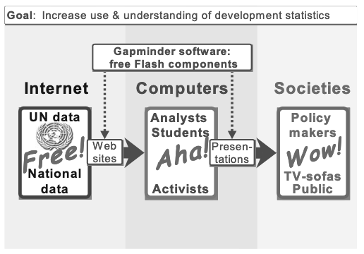

```{r setup, include=FALSE}
library(learnr)
library(gradethis)
library(tidyverse)
library(glue)
library(cli)
library(ggrepel)
knitr::opts_chunk$set(echo = FALSE)
tutorial_options(exercise.completion=FALSE)
```
```{r load-data, message=FALSE, warning=FALSE}
state <- Sys.getenv("tutorial.state")

stateName <- read_csv("https://the-art-of-data-journalism.github.io/tutorial-data/states.csv") |> filter(Postal == state) 

bigpublic <- read_csv("https://the-art-of-data-journalism.github.io/tutorial-data/college-cost/bigpublic.csv")

state_college <- bigpublic |> filter(STABBR == state)

state_college_count <- nrow(state_college)
```
## The Goal

In this lesson, you'll learn how to create bubble charts, which add a third dimension to scatterplots through varying circle sizes. By the end of this tutorial, you'll understand when bubble charts are effective, how to construct them using ggplot2, and how to enhance them with transparency and labels. You'll practice filtering data, adjusting visual elements, and using ggrepel for clear labeling. These skills will enable you to visualize complex relationships between three variables, a powerful tool for uncovering and communicating insights in your data journalism projects.

## Why Visualize Data?

Here is the real talk: Bubble charts are hard. 

The reason they are hard is not because of the code, or the complexity or anything like that. They're a scatterplot with magnitude added -- the size of the dot in the scatterplot has meaning. The hard part is seeing when a bubble chart works and when it doesn't. 

If you want to see it work spectacularly well, [watch a semi-famous Ted Talk](https://www.youtube.com/watch?v=hVimVzgtD6w) by Hans Rosling from 2006 where bubble charts were the centerpiece. It's worth watching. It'll change your perspective on the world. No seriously. It will.

That TED Talk, and the software his son created that you can see doing the visuals for his talk, turned a public health professor from Sweden into a bit of a global celebrity, to a very nerdy group of people. Rosling, with his son and daughter, started the Gapminder Foundation to further develop the software, which in 2007 was bought by Google. Time Magazine named him one of the 100 most influential people in 2012. Harvard University and the United Nations gave him awards. He wrote books about his worldview -- that we as a society vastly underestimate the progress the world has made across a number of different issues. A cottage industry of critics -- He's naive! He's a pollyanna! -- and defenders popped up, as it does when you have an enormous amount of attention on you. 

All because a professor used bubble charts in a talk on YouTube.

In a 2005 paper about their idea to use software to visualize global health and development data, the Roslings (Hans and his two children) wrote that "The representation of time by movement in scattergrams with carefully designed interfaces has proven to bring statistics beyond the eye to hit the brain."

But even they weren't sure it would actually work. But they had a vision. This graphic appeared in a paper published by the Organization for Economic Co-operation and Development -- the OECD. 

{width="100%"}
Free! Aha! Wow!

But Rosling's talks -- and his relentless enthusiasm for the data as it really is -- were infectious. And since then, people have wanted bubble charts. 

And we're back to the original problem: They're hard. 

## The Basics

To show how hard they are, let's try to make one. It should be quickly obvious to you that the code isn't the hard part. 

To make a bubble chart, you're making a scatterplot, just like we did in the previous exercise. Then you're adding one more element -- the size of the dot. 

I've got a subset of data from the last exercise. It's the same cost vs completion data, but this time, it's only for the largest public universities in each state. For almost every state, this is Big State U, where they have Big Time sports teams and jerseys you can buy in stores all over the state. A *lot* of media attention goes to exclusive private universities -- the Ivy League, for example -- but the truth is the overwhelming plurality of college educated adults went to Big State U. 

We don't need any new libraries from last time. We need the `tidyverse` and `ggrepel`.

```{r load-tidyverse, exercise=TRUE}
library(tidyverse)
library(ggrepel)
```
```{r load-tidyverse-solution}
library(tidyverse)
library(ggrepel)
```
```{r load-tidyverse-check}
grade_this_code()
```

And the data.

```{r load-data-exercise, exercise = TRUE}
bigpublic <- read_csv("https://the-art-of-data-journalism.github.io/tutorial-data/college-cost/bigpublic.csv")
```
```{r load-data-exercise-solution}
bigpublic <- read_csv("https://the-art-of-data-journalism.github.io/tutorial-data/college-cost/bigpublic.csv")
```
```{r load-data-exercise-check}
grade_this_code()
```

A bubble chart is just a scatterplot with one additional element in the aesthetic -- a size. Let's make the scatterplot version first. Let's first take a peek at the data. 

```{r bubble1, exercise=TRUE, exercise.setup = "load-data", message=FALSE}
head(bigpublic)
```
```{r bubble1-solution, exercise.reveal_solution = FALSE}
head(bigpublic)
```
```{r bubble1-check}
grade_this_code()
```

### Exercise 1: First, we scatterplot

To make this scatterplot, let's just repeat what we did last time: the cost on the x axis, the completion rate (`C150_4`) on the other. 

```{r bubble2, exercise=TRUE, exercise.setup = "load-data", message=FALSE}
ggplot() + 
  geom_point(data=____, aes(x=____, y=____))
```
```{r bubble2-solution, exercise.reveal_solution = FALSE}
ggplot() + 
  geom_point(data=bigpublic, aes(x=COSTT4_A, y=C150_4))
```
```{r bubble2-check}
grade_this_code()
```

Looks like a scatterplot, eh? But which of these schools really big and which ones ... aren't? 

### Exercise 2: The bubble chart

Let's add the size element. From our peek at the data above, we want to add the column that has the number of undergrads in it. That's a hint: the column is a weird shortening of that word.

```{r bubble3, exercise=TRUE, exercise.setup = "load-data", message=FALSE}
ggplot() + 
  geom_point(
    data=____, 
    aes(x=____, y=____, size=____)
    )
```
```{r bubble3-solution, exercise.reveal_solution = FALSE}
ggplot() + 
  geom_point(
    data=bigpublic, 
    aes(x=COSTT4_A, y=C150_4, size=UGDS)
    )
```
```{r bubble3-check}
grade_this_code()
```

What does this chart tell you? Seems there's some big schools that cost a bunch and are graduating a ton of people. There's some smaller schools who are kinda in the middle. And there's a small handful of small state schools who are graduating fewer than 40 percent of first-time first-year students.

Our chart needs some improvement.

### Exercise 3: Adding transparency and scale

We can make this more readable by adding an `alpha` element outside the aesthetic -- `alpha` in this case is transparency -- and we can manually change the size of the dots by adding `scale_size` and a `range`. Let's try an `alpha` of .3. 

```{r bubble4, exercise=TRUE, exercise.setup = "load-data", message=FALSE}
ggplot() + 
  geom_point(
    data=____, 
    aes(x=____, y=____, size=____),
    alpha = ____
    ) + 
  scale_size(range = c(1, 10))
```
```{r bubble4-solution, exercise.reveal_solution = FALSE}
ggplot() + 
  geom_point(
    data=bigpublic, 
    aes(x=COSTT4_A, y=C150_4, size=UGDS),
    alpha = .3) + 
  scale_size(range = c(1, 10))
```
```{r bubble4-check}
grade_this_code()
```

Better?

### Exercise 4: Adding a focus

What would help the most is if we added a school to focus on. So let's add your state's largest public university to this chart. First step -- filtering. Let's call that dataframe `state_college`.

```{r college-read, exercise=TRUE, exercise.reveal_solution = FALSE, exercise.setup = "load-data"}
____ <- bigpublic |> filter(STABBR == "____")
```

```{r college-read-check}
grade_this({
  if (identical(nrow(.result), state_college_count)) {
    pass("Great work! You now have your state colleges.")
  }
  fail()
})
```

```{r storysetup, exercise=FALSE, exercise.eval=TRUE, exercise.setup = "load-data", results='asis'}
glue("If you had an environment, you'd see you now have 1 school in {stateName$State}: {state_college$INSTNM}.")
```

### Exercise 5: Adding a red dot and labels

Let's add that school to the chart. We're going to do add a second `geom_point` that is identical in all ways to your first **except** for the dataframe. Then we'll add a `geom_text_repel` to our code. The `geom_text_repel` aes is the same as the `state_college` geom_point, except it needs a `label`. From the head step above, what would make a good label?  

```{r bubble7, exercise=TRUE, exercise.setup = "load-data", message=FALSE}
ggplot() + 
  geom_point(
    data=____, 
    aes(x=____, y=____, size=____),
    alpha = ____
    ) + 
  geom_point(
    data=____, 
    aes(x=____, y=____, size=____),
    color = "red"
    ) + 
  geom_text_repel(
    data=____, 
    aes(x=____, y=____, label=____)
    ) + 
  scale_size(range = c(1, 10))
```
```{r bubble7-solution, exercise.reveal_solution = FALSE}
ggplot() + 
  geom_point(
    data=bigpublic, 
    aes(x=COSTT4_A, y=C150_4, size=UGDS),
    alpha = .3
    ) + 
  geom_point(
    data=state_college, 
    aes(x=COSTT4_A, y=C150_4, size=UGDS),
    color = "red"
    ) + 
  geom_text_repel(
    data=state_college, 
    aes(x=COSTT4_A, y=C150_4, label=INSTNM)
    ) + 
  scale_size(range = c(1, 10))
```
```{r bubble7-check}
grade_this_code()
```

And what story does that tell? Where does your state's biggest public university fit in this picture? Is that a good or a bad thing? The next step after this? What about other schools that are similar to your state's largest? These institutions are multi-billion dollar entities in your state. They're a big deal.

## The Recap

Throughout this lesson, you've mastered the creation of bubble charts, learning to visualize relationships between three variables simultaneously. You've practiced transforming scatterplots into bubble charts, adjusting transparency and size scales for clarity, and adding labels to highlight key data points. Remember, while bubble charts can be powerful, they're most effective when used judiciously - when the relationships between all three variables tell a compelling story. Going forward, consider how bubble charts might reveal hidden patterns in your datasets, but always balance their complexity with the clarity of your message.

## Terms to Know

- Bubble chart: A variation of a scatterplot where data points are represented by circles (bubbles) whose sizes correspond to a third variable.
- Scatterplot: A type of chart that shows the relationship between two variables as points on a two-dimensional grid.
- `scale_size()`: A ggplot2 function used to adjust the range of sizes for elements like points in a bubble chart.
- range: In the context of scale_size(), this parameter sets the minimum and maximum sizes for the bubbles in the chart.
