```{r setup, include=FALSE}
library(learnr)
knitr::opts_chunk$set(echo = FALSE)
tutorial_options(exercise.completion=FALSE)
```

## The Goal

Nearly every other tutorial in this class uses R. This one doesn't.

This is the first of four pro tools lessons that step outside of R to cover skills every data journalist needs regardless of what software is open on their laptop. We're starting with spreadsheets because, R or no R, spreadsheets are where almost everyone starts.

By the end of this lesson, you'll be able to open a spreadsheet -- we're going to use Google Sheets because it's free, but everything in here will work with Microsoft Excel, the other industry standard spreadsheet -- and calculate an average, a median, a minimum, a maximum, a rank, a percentage and a percent change. You'll also know how to sort your way into a story idea. None of it requires code. All of it requires you to know where to click and what to type.

## Why Spreadsheets, Still?

Ask almost any data journalist how they got started, and you'll get the same answer: a spreadsheet.

For a long time, before "data journalism" was a phrase anyone used, spreadsheets *were* data journalism. Reporters would get a disk, or a stack of paper, or a public records request full of numbers, and the spreadsheet was the tool that turned that pile into an answer. That's still true today. Spreadsheets are relatively easy to learn -- you can pick up 80-90 percent of what you need in a day -- and they're flexible enough to handle almost anything organized into rows and columns.

They're also not going anywhere. Governments release data in spreadsheets. Businesses run on spreadsheets. Your source's budget is a spreadsheet. If you can't open one, sort it, and ask it a question, you will miss stories that are sitting in plain sight.

This lesson teaches you to do that math by hand, in a spreadsheet, with nothing else running. Later, [Lesson 12](#) teaches you how to pull a spreadsheet *into* R so you can do the same analysis with code -- more transparent, more reproducible, easier to check your work on a deadline three months from now. Both skills matter. How you use them depends on the time available and the importance of the analysis. In short: Need something quick that doesn't take much analysis? Spreadsheets are great. Have a lot of data wrangling and new column calculating to do? Code is better. 

## The Grid: Rows, Columns and Cells

If you've never opened a spreadsheet before, here's the whole idea in one paragraph: a spreadsheet organizes data into a grid. Rows run left to right. Columns run up and down. Where a row and a column meet is called a **cell**, and every cell can hold something -- a word, a number, a date, a dollar figure, or a formula that calculates something from other cells.

```{r grid-question}
question("In a spreadsheet, what do you call the box where a row and a column meet?",
  answer("A field"),
  answer("A cell", correct = TRUE),
  answer("A record"),
  answer("A tuple"),
  allow_retry = TRUE,
  random_answer_order = TRUE
)
```

Spreadsheets are also calculators -- much more powerful ones than the one in your junk drawer on that app on your phone. That's because this one can see every other cell on the sheet. To use it that way, you have to tell the spreadsheet you're about to compute something, and you do that with an **equal sign**. Open a spreadsheet in Google Docs right now, click any empty cell, and type:

`=2+2`

Hit enter. The formula disappears and a 4 shows up. That's the whole trick: every formula, no matter how complicated it eventually gets, starts with `=`.

```{r formula-start}
question_text(
  "Every formula in a spreadsheet has to start with this one character. Which character?",
  answer("=", correct = TRUE),
  allow_retry = TRUE,
  incorrect = "Close, but check the very first character you type -- it's not a letter or a word."
)
```

You can use any of the standard math symbols in a formula, the same ones you learned in [Lesson 1](#):

| Symbol | Meaning        | Example |
|--------|----------------|---------|
| \+     | addition       | 5+2     |
| \-     | subtraction    | 6-2     |
| \*     | multiplication | 7\*2    |
| /      | division       | 8/2     |
| \^     | exponent       | 2\^3    |

And the same order of operations rules apply. PEMDAS didn't stop mattering just because you left R.

## Functions Do the Typing for You

In a spreadsheet, you *could* do every calculation by spelling out the whole equation yourself. If you had five salaries in cells A2 through A6 and wanted the average, you could type:

`=(A2+A3+A4+A5+A6)/5`

But typing is the devil. It's tedious, and it's error-prone -- switch two numbers, or fat-finger a 5 into a 6, and you're wrong with no way to notice. And what happens when you have a thousand rows instead of five? You're not typing a thousand cell references into one formula.

This is where functions come in. A function has a name and takes inputs, the same idea as a function in R, just written differently. The pattern is:

`=FUNCTION(inputs)`

To tell a function you want a whole range of cells instead of naming them one by one, you use a colon: starting cell, colon, ending cell. `A2:A6` means "everything from A2 down through A6." So the average of those five salaries, the easy way, is:

`=AVERAGE(A2:A6)`

Same idea, one keystroke instead of retyping your whole dataset. Every function you learn in this lesson follows that same `=FUNCTION(range)` pattern.

Let's try this with real data. 

## Finding the Middle: Average and Median

If you don't already have one, create a free Google account. For 99.9 percent of the rest of you, [go to this Google Sheet](https://docs.google.com/spreadsheets/d/196PRRM4Lb2zlmTxjiyQOws81-XxZRHrZ0QWu4REMtFM/edit?usp=sharing) and make a copy of it. For those enrolled in a class, this is what you'll turn in for credit. 

> **Pro tip**
>
> If your columns look too narrow to read the data, click the blank rectangle above row 1 and to the left of column A -- that selects the entire sheet. Then double-click the line between any two column headers. Every column resizes to fit its contents at once.

### Exercise 1: Calculating an average

First things first, we have a sheet in our workbook called Source Data. Copy all of that data -- using Command key on Mac or Control on Windows and the A key to select all, Command/Control C to copy it and Command/Control V to paste it into the Exercise 1 sheet. 

**NOTE: Best practice, even today in a very digital world, is to work from a copy of your data.** That way, if you screw it up, it isn't lost. Most of the time, you can just go download another copy of it. But what happens when that spreadsheet comes at the end of a very long, likely litigious public records fight? Do you want to go back to them and say hey, I screwed up, can I have another copy of it? No. So work from a copy as a habit. Some day, it will save you. 

Now, with a copy of your data in Exercise 1, let's take a look at what we have. And what you have is a dataset of monthly sports gambling bets at Nebraska casinos. They have to report the amount of money bet on sports every month. What is the average amount gambled at a Nebraska casino every month?

Go down to the bottom of the sheet, past the last number in Column D, and type `=AVERAGE(???:???)` where the ??? are the first and last cells in column D with a number in it. Hint: Does row 1 have a number in it? What is the last row with a number? 

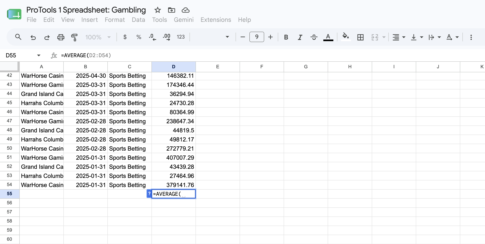
If you've put everything together, you should see that at the average casino on the average month, about $175,000 is gambled on sports *every month*. But scan the data up and down the column -- some places take in double that amount or more. Some places take in far less than that. 

The average -- what statisticians call the mean -- is a measure of the middle, but it's not the only one. Add up every value, divide by how many values there are, and you get a number that represents the group.

Take five students who tell you their annual income: \$8,000, \$9,500, \$7,200, \$10,000 and \$6,400. Add those up and you get \$41,100. Divide by 5 -- the number of students -- and the average income in the room is \$8,220. Reasonable. It's in the ballpark of everyone in the room.

Now suppose a sixth person walks in -- a football coach making \$5 million a year. Recalculate the average across all six incomes and suddenly the "average" income in the room is over \$874,000. Nobody in that room makes anywhere close to that -- students or coach. The average is technically correct and completely useless, because averages are sensitive to extreme values. One huge number can drag the whole thing off a cliff.

### Exercise 2: Calculating a median

That's where the median comes in. The median is the value in the exact middle of a sorted list -- half the values are above it, half are below. Unlike the average, one enormous outlier barely moves it. There's no shortcut formula for a median by hand -- you sort your numbers and find the middle one, which is a nightmare with a big dataset. In a spreadsheet, though, it's exactly as easy as an average:

`=MEDIAN(FirstCell:LastCell)`

Copy your source data over to the Exercise 2 sheet and, just like in Exercise 1, calculate a median for our monthly sports betting action number. 

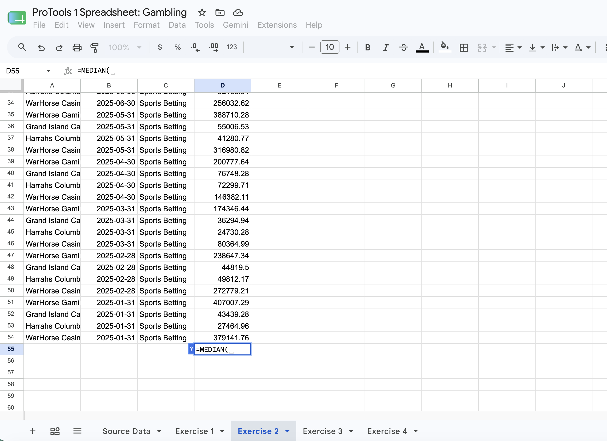
Notice how much lower the median value is? That's a sign there's some big numbers skewing things.

That's the whole game. You didn't need R or a statistics degree to find that gap. You needed one function and a question: why?

## Finding the Extremes: Min, Max, Sort and Rank

Averages and medians describe the middle. Sometimes the story is at the edges -- the biggest, the smallest, the fastest, the slowest. Two more functions, same pattern as before:

`=MIN(FirstCell:LastCell)`

`=MAX(FirstCell:LastCell)`

Point either one at a range and it hands back the smallest or largest value in it. Simple enough on 14 rows. Indispensable on 14,000.

### Exercise 3: Min/maxing your data

Copy your source data into the Exercise 3 sheet and down at the bottom, where we've been working, calculate the MIN and then do it again for the MAX right below it. So this time, you'll have two numbers. At this point, this should be pretty straightforward for you. Just remember to only include data rows in your MAX function -- don't include the results of the MIN function. It won't affect *this* calculation, but it would others. Best to learn not to do that now. 

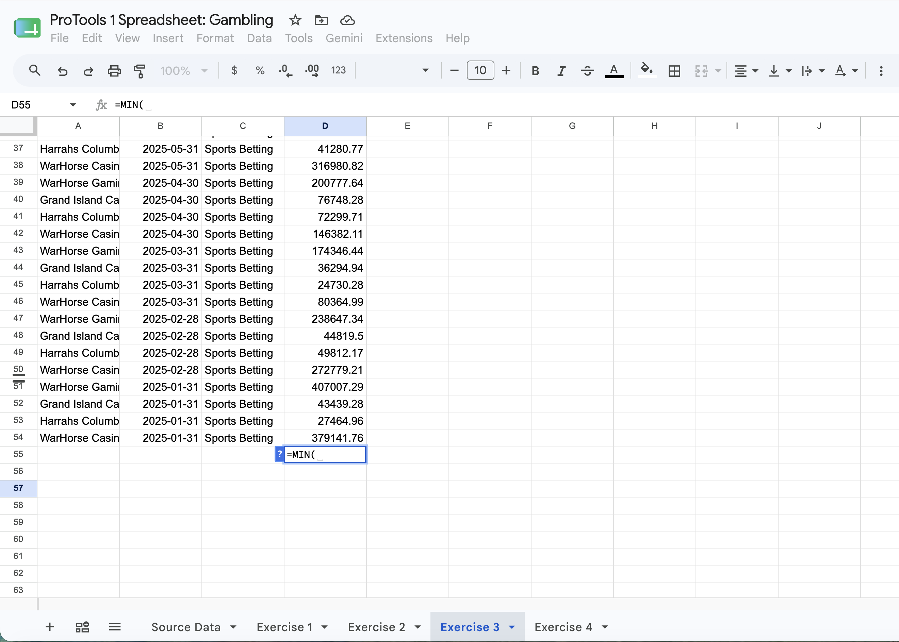
But a single minimum or maximum, by itself, is rarely interesting -- you need to know what it's *attached to*. That means sorting (arranging in tidyverse lingo). 

### Exercise 4: Sorting

Copy your data into the Exercise 4 sheet. Google makes this a little harder than it needs to be, so read carefully.

First, go up the Data menu then to Sort Range then down to Advanced range sorting options.

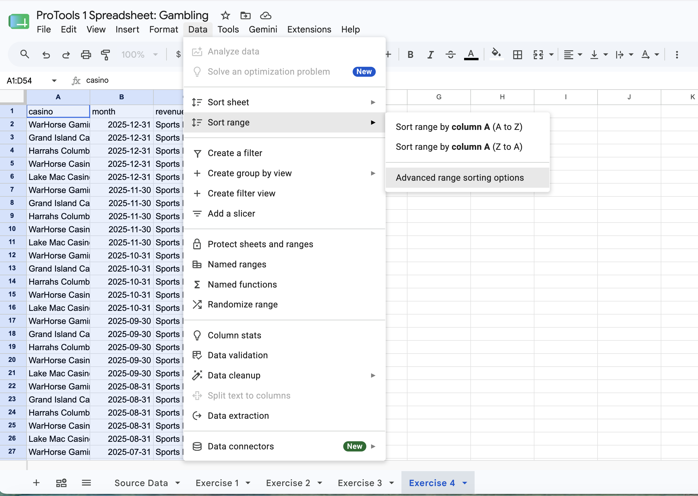
Then, with that window popped up, we want to select the Data has header row box, click the sort by box and change that to monthly_total and then sort by Z-A. What that will do is put the biggest number first, smallest last. Sort A-Z and you get the smallest first. 

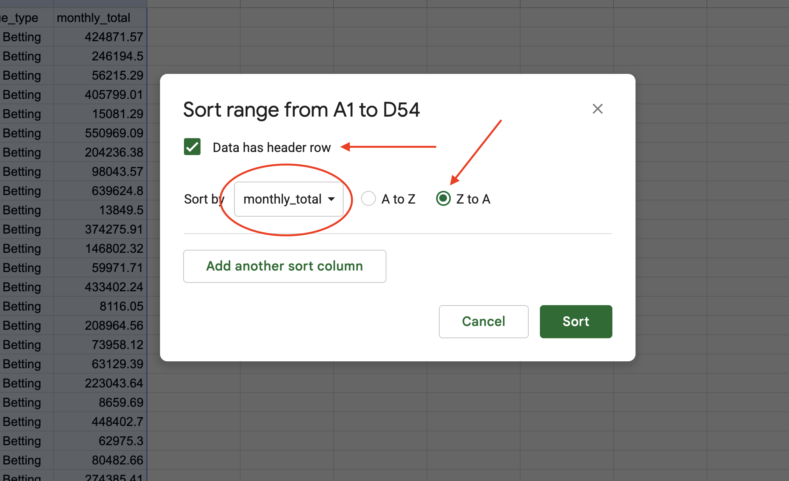
Note something interesting in your results: It's not that the two biggest values come from an Omaha and Lincoln casino. Population would tell you that was going to happen. What's interesting is that both took in the most month gambling on sports in November. 

## Pivot tables, filtering, ranking and change over time

Let's follow some curiosity about November handling so much sports gambling money. What gives? Does that hold true everywhere? Is it a sports calendar thing or a Lincoln/Omaha thing? 

The first thing we need is a way to add up all the casino data for each month. In R, we have group by and summarize. In spreadsheets -- Excel and Google Sheets both have these -- we have the Pivot Table. Most beginner data journalists feel like they discovered fire the first time they see a pivot table. For people with R experience, it's just group by and summarize. Ho hum. 

### Exercise 5: Make a pivot table

Copy your source data to the Exercise 5/6/7 sheet **and make sure it's still highlighted after pasting it in**. If it's not, hit Command/Control A again. We're going to combine a bunch of steps into one sheet, thus the name. 

With your data highlighted, click on the Insert menu button and go down to Pivot Table. 

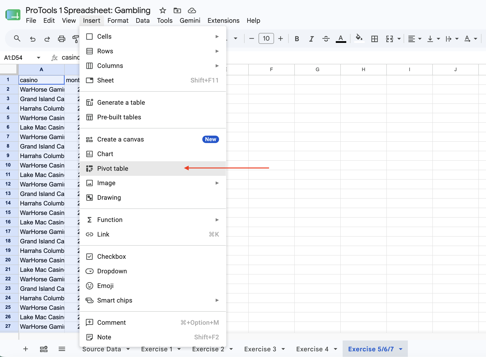

In the Pivot Tables menu we've got some work to do. The Data Range should already be filled out for you. We're going to add this to an Existing Sheet (the one you're working on), so click that. Then, click on cell F1 (your screen will change when you do this) and click OK. Then, click Create.

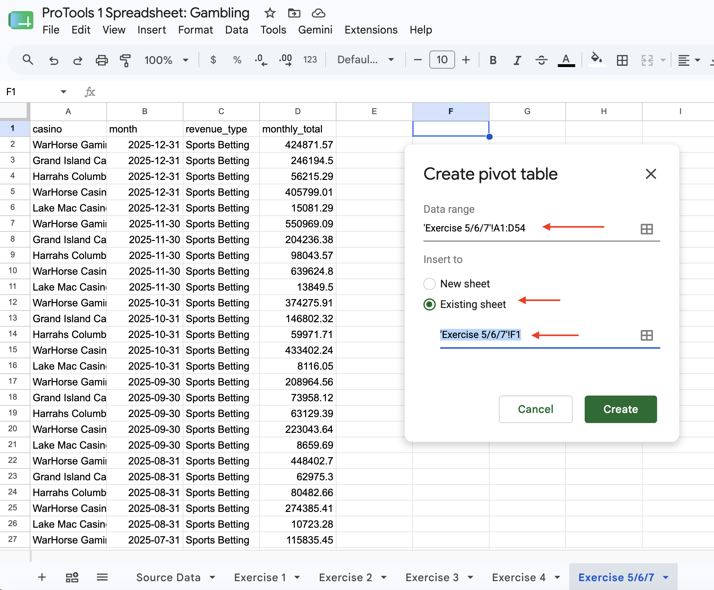

Now Google Sheets, in 2026, is loaded with all kinds of AI assistance and suggested things. We're going to do this the hard way so you know how. That way, when the suggested isn't something you want or the AI doesn't understand what you're after, you can do it yourself. 

Pivot tables are made up of rows and columns too. We'll worry less about columns today -- we just need two, and they'll be handled for us. First, add rows and make that month. Second, add a *value* and select monthly_total. Note it defaults to the SUM, which is what we want. But you can change it to other measures as well if you want (aka a MEAN or MEDIAN). 

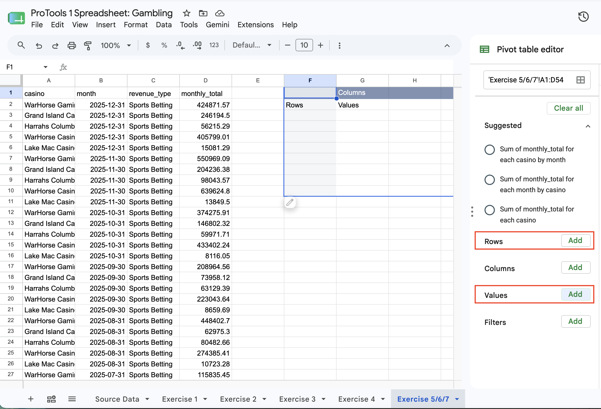
And there it is. The monthly total handle in the state for sports gambling. Look at November and December now? Seems like something is up there. 

### Exercise 6: Ranking

Editors everywhere love a ranking, and spreadsheets make that easy. It's a fairly simple formula.

`=RANK(CellToRank, $Column$FirstRowRange:$Column$LastRowInRange)`

That tells the spreadsheet: take this one cell -- the cell to rank -- and tell me where it lands compared to everything in this range. Note the dollar signs. In spreadsheets, dollar signs are called *anchors*. The anchor means when you copy this formula, DO NOT CHANGE these values. If you do, the rank gets thrown off. The first cell and the last cell are always going to stay the same. 

If you have put your pivot table in F1, go to H2 and try your Rank formula. You're ranking the total dollar amount for January against all the values in column G. **REMEMBER THE ANCHORS. BOTH THE COLUMN AND ROW ANCHORS.**

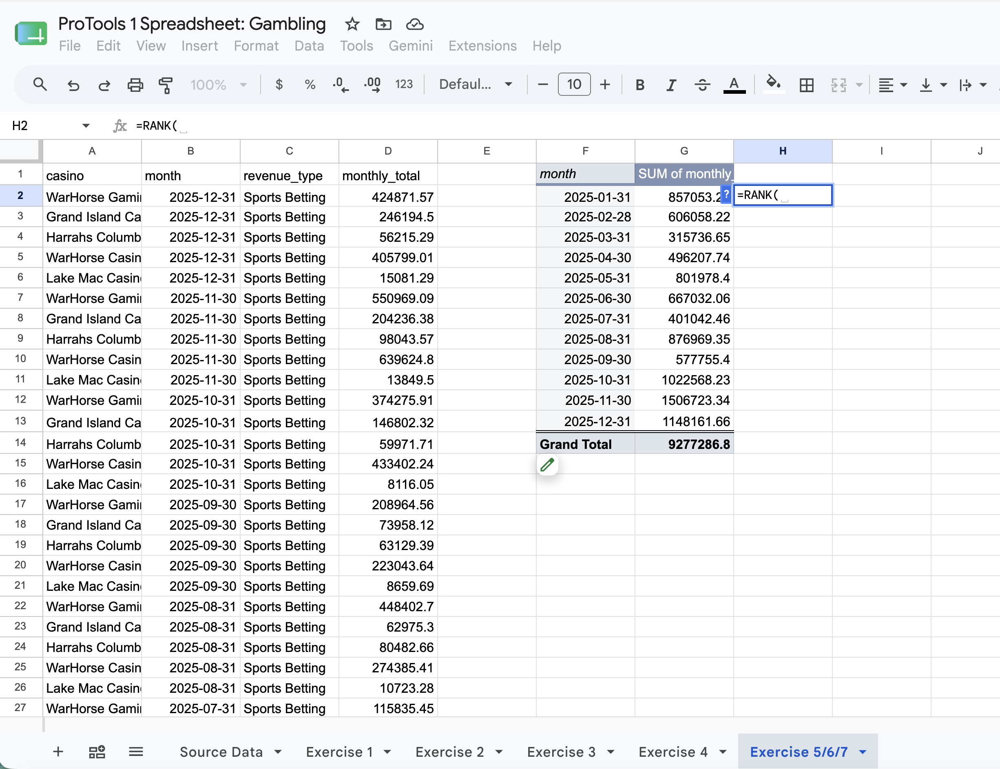

Now, notice earlier I said copy the formula. What does that mean? It's very likely Google gave you a Suggested Auto Fill and in most cases, it does what you want. In this case, it'll try to include the Grand Total (which you do not want). But if you clicked off it or Google fails to suggest how to copy a formula down, note the dot in the bottom right corner of your formula cell. If you click and hold on that and drag it down to Row 13, Sheets will automatically change the formula so it increments down for each row. 

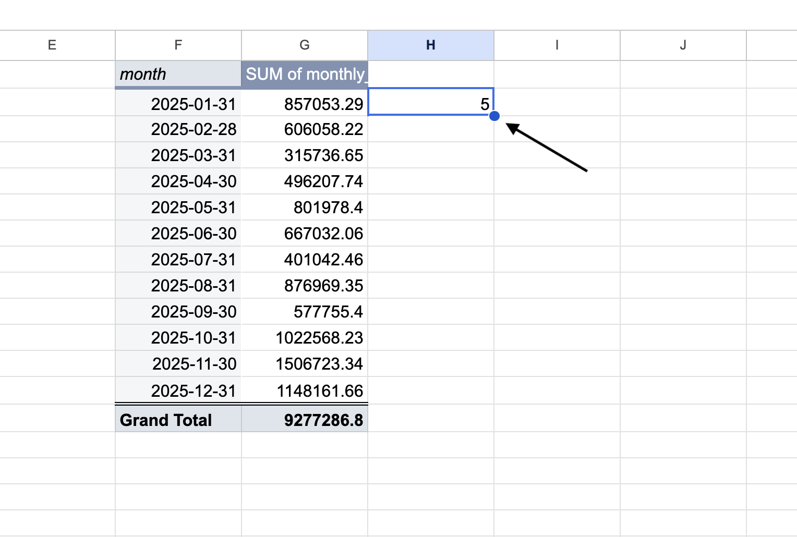

Copy the formula down the column and every row gets its own rank. And look at that. The top 3 months for gambling on sports are all in the fall. Why might that be?

### Exercise 7: Change over time

Percent change tells you how much something grew or shrank between two points in time, and it's the one calculation that separates reporters who can do basic data journalism from reporters who can't. It shouldn't. The formula is short enough to memorize:

`(New - Old) / Old`

Take a professor who made \$65,000 last year and \$66,000 this year. `(66000-65000)/65000` works out to .0154 -- multiply by 100 and the professor got a 1.5 percent raise. That's the entire calculation, whether you're doing it by hand, in R, or in a spreadsheet.

```{r change-question}
question("A county had 40,000 residents last year and 42,000 this year. What formula calculates its percent change?",
  answer("=(42000-40000)/42000"),
  answer("=(42000-40000)/40000", correct = TRUE),
  answer("=(40000-42000)/40000"),
  answer("=42000/40000"),
  allow_retry = TRUE,
  random_answer_order = TRUE
)
```

In a spreadsheet, the formula looks the same, just with cell references instead of numbers. Say you have U.S. Census population estimates with an older year's population in column E and this year's in column J. In the first empty column, type:

`=(J2-E2)/E2`

In your Exercise 5/6/7 sheet, in column E, let's calculate the percent change for each month. You'll have to start on the February line because ... we don't have something before January. Using what you've learned, apply (New - Old)/Old in column E. Copy it down to December. 

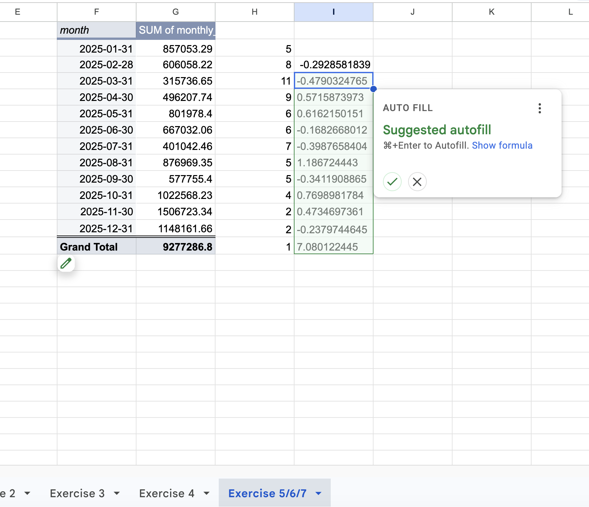
Note that if you accept Google's Auto Fill suggestion, it adds the Grand Total into your calculations. It doesn't affect anything. It just means that last number is meaningless. There's a 700 percent increase between December and the sum total for the entire year statewide? Do tell!

Now, note that your percent is still a decimal. There's two ways to fix that. You can fix it in your formula -- multiply the result by 100, or `((New - Old)/Old)*100`. Or you can format it in the sheet as a percent. You can do that by clicking on the percent format button. 

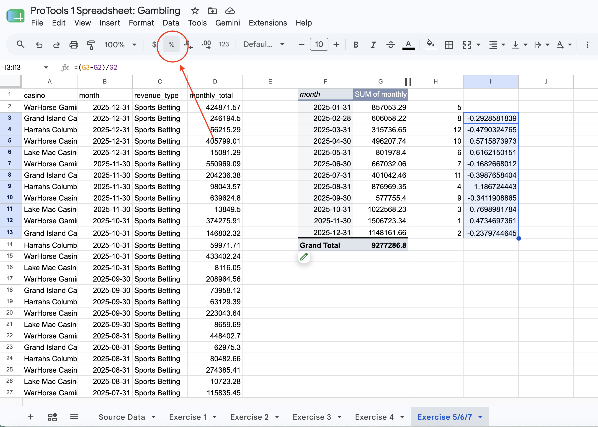
So college football season is big for sports betting, and November is the biggest month for it. December is a close second, but does trail off from November. 

## The Recap

In this lesson, you learned to do real data journalism math without writing a line of code. You calculated an average with `AVERAGE()` and saw why an extreme value can wreck it. You calculated a median with `MEDIAN()` and saw why it doesn't. You found the smallest and largest values in a column with `MIN()` and `MAX()`, sorted a dataset to put extremes in context, and built a ranking with `RANK()`. You used pivot tables and calculated a percent change, which shows up in more data journalism stories than any others combined. Every one of these skills transfers directly, formula for formula, between Excel and Google Sheets -- and every one of them is also something you now know how to do in R.

## Terms to Know

- **Cell**: The box where a row and a column meet in a spreadsheet; holds a single piece of data or a formula.
- **Function**: A named, reusable calculation in a spreadsheet, written as `=FUNCTION(inputs)`.
- **Range**: A block of cells referred to by its first and last cell, separated by a colon, like `A2:A50`.
- **AVERAGE()**: A function that calculates the mean of a range of numbers.
- **MEDIAN()**: A function that finds the middle value of a sorted range of numbers.
- **MIN() / MAX()**: Functions that return the smallest or largest value in a range.
- **RANK()**: A function that returns a cell's rank compared to a range of other values.
- **Sort**: Reordering rows in a spreadsheet by the values in one column, ascending or descending.
- **Percent change**: The formula `(New - Old) / Old`, used to measure growth or decline between two points in time.
